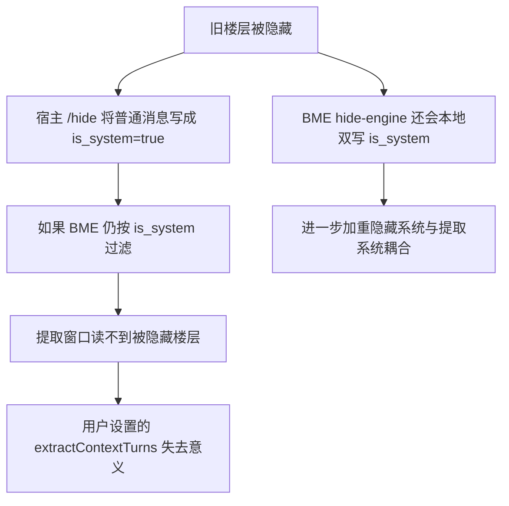

# Hide / is_system 解耦与提取窗口收敛方案

## 背景与用户真实诉求

用户要解决的不是单点 bug，而是两个长期耦合问题：

1. **自动隐藏旧楼层应只负责 `/hide` / `/unhide`**
   - 不希望 BME 再本地改 `message.is_system`
   - “重新应用当前隐藏”和“取消隐藏”也应收敛成 `/hide` / `/unhide`

2. **BME 提取应按用户在“配置 -> 详细参数”里设置的上下文窗口读取**
   - 目标参数是 `extractContextTurns`
   - 主 AI 通过隐藏减少 token
   - BME 仍能读到足够上下文，但不会无限读太多

用户不希望继续出现以下情况：

1. 隐藏状态影响 BME 是否能读到上下文
2. 隐藏逻辑与历史恢复/提取逻辑继续共享 `is_system`
3. 改掉一处后，另一处又因为 `is_system` 语义不清而出新 bug

---

## 这次梳理后的核心结论

### 结论 1：宿主 ST 的 `/hide` 本身就会改底层消息对象的 `is_system`

这个结论已经通过运行时实测确认：

1. 隐藏前：普通 assistant 消息对象没有 `is_system`
2. 手动执行 `/hide 6-6`
3. 隐藏后：同一条消息出现 `is_system: true`

这意味着：

1. **不能把“去掉 BME 自己的 `is_system` 双写”当成最终解**
2. 即使删掉 `hide-engine.js` 里的 `markManagedSystemRange` / `restoreManagedSystemFlags`
3. 宿主 `/hide` 仍然会把普通历史消息变成 `is_system=true`

因此，若 BME 提取链路继续按 `is_system` 过滤消息，用户的目标仍然无法实现。

---

### 结论 2：当前提取链路虽然已经部分松绑，但还没有真正完成“纯 `/hide`”

当前代码状态：

1. [chat-history.js](C:\Users\brian\OneDrive\Desktop\ST-Bionic-Memory-Ecology-past\chat-history.js)
   - 已新增 `isBmeManagedHiddenMessage`
   - 已新增 `isSystemMessageForExtraction`
   - `getAssistantTurns`
   - `buildExtractionMessages`
   - `getChatIndexForPlayableSeq`
   这些核心函数已经不再把 `extra.__st_bme_hide_managed === true` 的消息视为不可提取

2. [index.js](C:\Users\brian\OneDrive\Desktop\ST-Bionic-Memory-Ecology-past\index.js)
   - `getSmartTriggerDecision` 相关路径已开始复用上述提取判定

但问题在于：

1. 这些改动目前只照顾到了 **BME 自己打了 `__st_bme_hide_managed` 标记** 的消息
2. **宿主手动 `/hide`** 会直接把消息写成 `is_system=true`，但不会带 BME 标记
3. 所以“真正的纯 `/hide` 设计”还没有完成

换句话说：

> 现在已经从“完全依赖 `is_system`”前进到了“BME 自己隐藏的消息可以继续提取”，但还没有前进到“凡是被 `/hide` 隐藏的普通楼层都能继续被 BME 按窗口读取”。

---

### 结论 3：宿主 `/hide` 大概率没有稳定附加标记，阶段 2 不应继续押注“找宿主字段”

基于当前实测：

1. 宿主手动 `/hide` 后，消息会新增 `is_system: true`
2. 当前没有证据表明 `extra` 或其他 message 字段会稳定补充“这是 host hidden ordinary message”的标记

因此，阶段 2 的主策略不应是：

1. 继续猜测 `extra.hidden`
2. 继续猜测宿主会补别的 message-level 标记

更稳的策略应改为：

1. **让 hide-engine 暴露“BME 当前管理的隐藏范围”查询能力**
2. extraction 侧按 index 查询“这个楼层是否在 BME 管理隐藏范围内”
3. 把“BME 自动隐藏的普通楼层”和“真正 system 消息”区分开

这条策略的边界也要说清楚：

1. 它优先解决的是**用户最初诉求里的“BME 自动隐藏旧楼层”**
2. 它不自动等价于“宿主任意手动 `/hide` 的所有楼层都被 BME 当可提取消息”

也就是说，第一轮落地目标应是：

> 保证 BME 自己自动 `/hide` 的旧楼层不会再干扰 extraction，而不是一次性接管所有外部手动 `/hide` 场景。

---

### 结论 4：仍有若干非提取链路在按 `is_system` 过滤，但不应与本次目标混为一谈

本次梳理中仍能看到这些位置：

1. [index.js](C:\Users\brian\OneDrive\Desktop\ST-Bionic-Memory-Ecology-past\index.js)
   - `getLatestUserChatMessage`
   - `getLastNonSystemChatMessage`

2. [recall-controller.js](C:\Users\brian\OneDrive\Desktop\ST-Bionic-Memory-Ecology-past\recall-controller.js)
   - `buildRecallRecentMessagesController` 仍跳过 `is_system`

3. [recall-persistence.js](C:\Users\brian\OneDrive\Desktop\ST-Bionic-Memory-Ecology-past\recall-persistence.js)
   - `resolveGenerationTargetUserMessageIndex` 在 normal generation 下会跳过 `is_system`

这些逻辑未必是 bug。它们更偏：

1. recall / send-intent / prompt 注入输入整形
2. 面向主 AI 可见聊天尾部，而不是 extraction 读取窗口

所以不建议在“纯 `/hide` + extraction 去耦”阶段把 recall 逻辑一起大改。否则改动面会过大，容易把“主 AI 的可见上下文策略”和“BME 的提取上下文策略”混在一起。

---

## 现状问题图

---

## 已确认的代码位置

### A. 当前仍在本地双写 `is_system` 的隐藏引擎

[hide-engine.js](C:\Users\brian\OneDrive\Desktop\ST-Bionic-Memory-Ecology-past\hide-engine.js)

关键位置：

1. `markManagedSystemRange`
   - 直接写 `message.is_system = true`
   - 写入 `extra.__st_bme_hide_managed = true`
   - 同步 DOM `is_system` attribute

2. `restoreManagedSystemFlags`
   - 直接写回 `message.is_system = false`
   - 删除 `extra.__st_bme_hide_managed`
   - 同步 DOM `is_system` attribute

### B. 当前提取窗口的核心入口

[chat-history.js](C:\Users\brian\OneDrive\Desktop\ST-Bionic-Memory-Ecology-past\chat-history.js)

关键函数：

1. `isAssistantChatMessage`
2. `getAssistantTurns`
3. `buildExtractionMessages`
4. `getChatIndexForPlayableSeq`
5. `getChatIndexForAssistantSeq`

### C. 当前仍会影响提取/恢复批次推进的上层入口

[extraction-controller.js](C:\Users\brian\OneDrive\Desktop\ST-Bionic-Memory-Ecology-past\extraction-controller.js)

关键函数：

1. `runExtractionController`
2. `onManualExtractController`
3. `onRerollController`
4. `executeExtractionBatchController`

### D. 当前“读取窗口配置”的用户入口

[panel.js](C:\Users\brian\OneDrive\Desktop\ST-Bionic-Memory-Ecology-past\panel.js)

关键字段：

1. `bme-setting-extract-context-turns`
2. `settings.extractContextTurns`

这说明用户最初说的“BME 读取用户自己设置的 N 楼层”并不是新概念，代码里已经有配置入口；问题在于提取链路还没有完全摆脱 `is_system` 对窗口的干扰。

---

## 设计判断

### 判断 1：不要再把 `is_system` 当成 extraction 的最终真相

在当前宿主语义下：

1. `is_system=true`
2. 既可能表示“真正的系统消息”
3. 也可能表示“被 `/hide` 隐藏的普通历史楼层”

因此：

1. 对主 AI prompt 组装来说，`is_system` 也许仍然有意义
2. 但对 BME extraction 来说，`is_system` 已经不是可靠的“是否可读”判据

### 判断 2：要把“主 AI 可见消息集合”和“BME 提取消息集合”彻底拆开

建议明确分成两套语义：

1. **主 AI 可见集合**
   - 可以继续受 `/hide` 影响
   - 这是节约 token 的目的

2. **BME 提取集合**
   - 应由“真实楼层窗口 + `extractContextTurns`”决定
   - 不应因为楼层被 `/hide` 而自动丢失

### 判断 3：在 extraction 真正去耦之前，不要删除 hide-engine 的本地双写

原因不是双写本身正确，而是现在直接删会导致两个风险：

1. 提取链路仍可能把宿主 `/hide` 后的消息当成不可提取
2. 现有测试和状态恢复逻辑仍依赖 `__st_bme_hide_managed` 追踪“哪些是 BME 自己接管过的消息”

所以：

> hide-engine 的本地双写最终应删除，但删除动作必须放到 extraction 语义彻底收敛之后。

### 判断 4：`managedSystemIndices` 在阶段 4 不能直接消失，而要重定义语义

当前 `hideState.managedSystemIndices` 同时承担两层职责：

1. 追踪“哪些消息曾被 BME 本地写成 `is_system=true`”
2. 作为 `__st_bme_hide_managed` 的间接来源，帮助 extraction 判断“哪些是 BME 自己接管过的隐藏范围”

当阶段 4 删除本地双写后：

1. 第一层职责不再需要
2. 第二层职责仍然需要，只是语义应变成：
   - “BME 当前管理的隐藏范围/索引集合”
   - 而不是“BME 本地改过 `is_system` 的消息集合”

所以阶段 3 -> 4 的过渡不能只是删函数，还必须同步：

1. 重命名或重定义 `managedSystemIndices`
2. 让 extraction helper 改为查询“managed hide range”而不是 `__st_bme_hide_managed`

---

## 推荐执行顺序

### 阶段 1：先把 extraction 的“可读消息判定”抽象成独立策略

目标：

1. 不要让 `chat-history.js` 继续直接用“`is_system` + BME marker”做最终判定
2. 改成一层明确的语义函数，例如：
   - `isManagedHiddenMessageAtIndex`
   - `isTrueSystemMessageForExtraction`
   - `isExtractionVisibleMessage`

建议动作：

1. 在 [chat-history.js](C:\Users\brian\OneDrive\Desktop\ST-Bionic-Memory-Ecology-past\chat-history.js) 收口所有提取可见性判断
2. 让：
   - `getAssistantTurns`
   - `buildExtractionMessages`
   - `getChatIndexForPlayableSeq`
   - `getChatIndexForAssistantSeq`
   全部只依赖这组新 helper

目的：

1. 以后改宿主 `/hide` 兼容策略时，只改一层 helper
2. 不再把 `is_system` 判断分散在多个函数里

### 阶段 2：改成“由 hide-engine 暴露管理范围”，不要继续押注宿主附加标记

当前已知：

1. 宿主 `/hide` 会把普通消息改成 `is_system=true`
2. 当前没有可靠证据表明宿主会补充稳定的 message-level 隐藏标记

因此阶段 2 建议改成：

1. 在 [hide-engine.js](C:\Users\brian\OneDrive\Desktop\ST-Bionic-Memory-Ecology-past\hide-engine.js) 暴露查询接口，例如：
   - `isInManagedHideRange(index)`
   - 或 `isManagedHiddenIndex(index)`
2. extraction 侧不再猜测“这条 `is_system` 是否是 host hide 后的普通消息”
3. 而是直接问 hide-engine：
   - “这个 index 是否处在 BME 当前管理的隐藏范围内？”

这样做的好处：

1. 不依赖宿主是否打标记
2. 不依赖消息内容特征猜测
3. 与用户真实需求更一致，因为用户要解决的是 **BME 自动隐藏旧楼层** 场景

这也意味着阶段 2 的设计边界应明确写入：

1. 第一轮保证“BME 自动隐藏”与 extraction 解耦
2. 宿主手动 `/hide` 是否也纳入 extraction，可放在后续兼容层处理

### 阶段 3：让 extraction 真正按窗口读取，而不是按 hidden/system 可见性读取

目标：

1. 真正实现“BME 读取用户配置的 N 楼层”
2. `extractContextTurns` 成为决定提取上下文的主参数

建议动作：

1. 在 [chat-history.js](C:\Users\brian\OneDrive\Desktop\ST-Bionic-Memory-Ecology-past\chat-history.js) 明确：
   - assistant turn 序列如何计算
   - `startIdx/endIdx` 对应的上下文窗口如何取
   - 哪些消息只是“不进入主 AI prompt”，但仍进入 extraction

2. 确保 [extraction-controller.js](C:\Users\brian\OneDrive\Desktop\ST-Bionic-Memory-Ecology-past\extraction-controller.js) 的：
   - 自动提取
   - 手动提取
   - reroll / replay
   全部共享同一套 assistant turn 与 context window 判定

3. 验证 `extractContextTurns` 的语义在 UI 和代码里保持一致
   - 用户设置多少，就读取多少个上下文轮次

阶段 3 还要额外补一条验证说明：

1. 当前 [chat-history.js](C:\Users\brian\OneDrive\Desktop\ST-Bionic-Memory-Ecology-past\chat-history.js) 的
   `contextStart = Math.max(0, startIdx - contextTurns * 2)`
   本质上是按 chat index 偏移，不是按“真实可提取 turn 数”回溯
2. 当中间夹杂真正 system 消息时，用户设置的 `extractContextTurns` 可能仍会少读

这条不一定是 blocker，但阶段 3 验收必须补测试：

1. 中间夹有真正 system 消息时，窗口是否仍符合用户对“最近 N 个 turn”的预期
2. 若不符合，再决定是否把窗口算法从“index 偏移”升级成“按 assistant/user turn 回溯”

### 阶段 4：只有在阶段 3 通过后，才移除 hide-engine 的本地 `is_system` 双写

目标：

1. 把隐藏引擎收敛成纯 `/hide` / `/unhide`

建议动作：

1. 在 [hide-engine.js](C:\Users\brian\OneDrive\Desktop\ST-Bionic-Memory-Ecology-past\hide-engine.js) 删除或废弃：
   - `markManagedSystemRange`
   - `restoreManagedSystemFlags`
   - `syncSystemAttribute`
   - `__st_bme_hide_managed` 相关逻辑

2. 保留：
   - 范围计算
   - slash command 调度
   - 增量隐藏检查
   - unhide 管理
   - managed hide range 查询接口

3. 重写相关测试，使其不再断言：
   - “applyHideSettings 后 chat[i].is_system 被 BME 写成 true”

而改为断言：

1. 发出了正确的 `/hide` / `/unhide` 命令
2. extraction 在隐藏开启时仍能读到配置窗口内的上下文
3. `managedSystemIndices`（或其重命名版本）已从“本地双写追踪器”转成“managed hide range 状态”

---

## 需要修改/复核的文件清单

### 必改

1. [chat-history.js](C:\Users\brian\OneDrive\Desktop\ST-Bionic-Memory-Ecology-past\chat-history.js)
   - 提取可见性判定的唯一真源

2. [extraction-controller.js](C:\Users\brian\OneDrive\Desktop\ST-Bionic-Memory-Ecology-past\extraction-controller.js)
   - 自动提取 / 手动提取 / reroll / replay 是否完整复用新判定

3. [hide-engine.js](C:\Users\brian\OneDrive\Desktop\ST-Bionic-Memory-Ecology-past\hide-engine.js)
   - 最终收敛为纯 `/hide` / `/unhide`

4. [tests\chat-history.mjs](C:\Users\brian\OneDrive\Desktop\ST-Bionic-Memory-Ecology-past\tests\chat-history.mjs)
   - 扩展为“宿主 `/hide` 产生的普通 system 化消息仍可被 extraction 读取”的测试

5. [tests\hide-engine.mjs](C:\Users\brian\OneDrive\Desktop\ST-Bionic-Memory-Ecology-past\tests\hide-engine.mjs)
   - 重写对 `is_system` 的旧预期

### 视范围决定是否同步调整

1. [index.js](C:\Users\brian\OneDrive\Desktop\ST-Bionic-Memory-Ecology-past\index.js)
   - 任何仍影响 extraction 预判的 `is_system` 过滤

2. [panel.js](C:\Users\brian\OneDrive\Desktop\ST-Bionic-Memory-Ecology-past\panel.js)
   - 仅确认配置语义，无需大改

3. [recall-controller.js](C:\Users\brian\OneDrive\Desktop\ST-Bionic-Memory-Ecology-past\recall-controller.js)
4. [recall-persistence.js](C:\Users\brian\OneDrive\Desktop\ST-Bionic-Memory-Ecology-past\recall-persistence.js)
   - 建议暂不并入第一轮，除非后续验证发现 recall 也必须读取被隐藏楼层

另外明确说明两处当前不建议改动：

1. [index.js](C:\Users\brian\OneDrive\Desktop\ST-Bionic-Memory-Ecology-past\index.js) 的 `getLatestUserChatMessage`
2. [index.js](C:\Users\brian\OneDrive\Desktop\ST-Bionic-Memory-Ecology-past\index.js) 的 `getLastNonSystemChatMessage`

原因：

1. 这两处属于 recall / send-intent 输入整形
2. 面向主 AI 可见尾部，而不是 extraction 读取窗口
3. 当前保持按裸 `is_system` 跳过隐藏楼层是合理的，不应并入本次 extraction 解耦

---

## 建议测试矩阵

### A. 纯 extraction 语义

1. 宿主 `/hide` 前后，同一条普通 assistant 消息都应仍可被提取窗口覆盖
2. `extractContextTurns=2` 时，只读取目标 assistant 前固定窗口，不无限扩张
3. 自动提取、手动提取、replay、reroll 的窗口语义一致
4. 中间夹有真正 system 消息时，窗口语义是否仍满足“最近 N 个 turn”的产品预期

### B. 隐藏与主 AI 可见性

1. 开启旧楼层隐藏后，主 AI 仍只看到保留窗口
2. BME 仍能从被隐藏楼层中拿到所需上下文
3. BME 自动隐藏场景依赖的是 managed hide range，而不是宿主附加消息标记

### C. 回归风险

1. 不再因隐藏状态变化触发历史误恢复
2. 自动提取在新聊天中继续正常推进
3. 历史恢复后 extraction status 不再残留“AI 生成中”

---

## 对另一个 AI 的最短结论

> 用户的目标是“隐藏只负责 `/hide`，提取只负责按 `extractContextTurns` 读真实楼层窗口”。本次梳理已确认宿主 ST 的 `/hide` 本身就会把普通消息写成 `is_system=true`，因此不能靠删除 BME 本地 `is_system` 双写来完成解耦。当前最稳的阶段 2 主策略，不是继续寻找宿主附加标记，而是让 `hide-engine.js` 暴露 managed hide range 查询接口，由 extraction 按 index 反查“这个楼层是否是 BME 自动隐藏范围的一部分”，从而把 BME 自动隐藏的普通楼层与真正 system 消息区分开。只有在 extraction 彻底摆脱 `is_system` 依赖后，才能安全把 `hide-engine.js` 收敛成纯 `/hide` / `/unhide`。 
