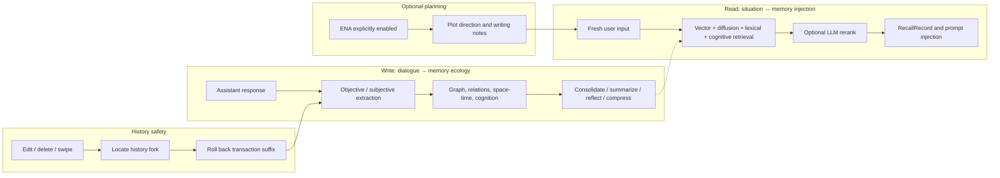

# ST-BME — SillyTavern Bionic Memory Ecology

> Let the AI truly remember your story.

[中文](README.md) · **English**

ST-BME (Bionic Memory Ecology) is a **third-party SillyTavern frontend extension**. It organizes characters, events, locations, rules, plot threads, reflections, and subjective memories from long chats into a continuously evolving memory graph, then recalls the information most relevant to the current situation before generation.

It is not merely a tool that compresses old chat into one summary. BME distinguishes objective facts from character perspectives, preserves relationships, story time, and cognitive boundaries, and lets memories consolidate, summarize, reflect, and compress as the story develops. When chat history is edited, deleted, or rerolled, the memory state returns to the matching point in that history.

---

## Core capabilities

- **Objective + subjective extraction** — After an assistant response, BME extracts events, character state, locations, rules, and plot threads from the current dialogue batch, then creates emotional, biased, or mistaken POV memories only for characters who actually experienced it.
- **Multi-layer hybrid recall** — Combines vector prefiltering, graph diffusion, lexical boosting, context blending, multi-intent splitting, temporal relations, cognitive scope, DPP diversity sampling, and optional LLM reranking.
- **Cognitive memory architecture** — Keeps objective world knowledge, character POV, and user POV separate. A character can recall only what they have reason to know, including uncertain or mistaken beliefs.
- **Story space and time** — Tracks active regions, spatial adjacency, story-time labels, and temporal updates so “mentioned later in chat” is not confused with “happened later in the story.”
- **Memory consolidation and evolution** — New memories can be compared with old nodes, merged, or connected through update, contradiction, and evolution relations instead of becoming isolated duplicates.
- **Hierarchical summaries and compression** — Stage summaries roll up into higher-level context. Older memories lose expendable detail while retaining causality, irreversible outcomes, relationship changes, and unresolved threads.
- **Reflection and optional forgetting** — Generates narrative reflections on a schedule and can run sleep-cycle and low-value-memory processing so the graph does not grow without bound.
- **ENA plot planning** — An optional pre-send planner that reads character cards, World Info, recent chat, BME memory, and previous plans to guide the next response's plot direction and writing priorities.
- **Unified task profiles** — Objective extraction, subjective extraction, recall, consolidation, compression, summaries, reflection, and planning all use Task Profiles that compose prompt blocks, generation options, World Info, regex, and template variables.
- **Visualization and management** — Includes a Canvas graph for browsing relations, editing, archiving, and deleting memories, plus graph import/export and vector rebuilding.
- **History consistency** — When floors are deleted or edited, an existing swipe is selected, a response is regenerated, or chats are switched, the graph, recall records, planning records, and derived vectors reconcile with the actual chat history.
- **Two persistence options** — Uses browser IndexedDB by default, or works with ST-Delegation-of-authority to place state transactions and derived vectors under the Authority Primary.

---

## Memory model

BME maintains these memory types by default:

| Type | What it records | Behavior |
| --- | --- | --- |
| `event` | What happened, participants, causes, and outcomes | Supports hierarchical compression while preserving turning points and unresolved consequences |
| `character` | Traits, current state, goals, inventory, and long-term notes | Updates the current state of the same character as the story changes |
| `location` | A place's state, features, resources, and dangers | Can carry region paths and adjacency relationships |
| `rule` | World rules, constraints, scope, and active status | Participates in recall as a durable constraint |
| `thread` | Main plots, subplots, unresolved hooks, and progress | Supports stage rollups and completion state |
| `synopsis` | High-level summaries of established events | Provides stable background for very long chats |
| `reflection` | Higher-level insight into patterns, contradictions, and possible direction | Recalled when relevant to the present situation |
| `pov_memory` | How one character or the user remembers something | Preserves emotion, attitude, belief, misunderstanding, and certainty |

Edges express more than generic similarity. They can represent participation, location, plot advancement, state updates, contradiction, memory evolution, and temporal replacement. This lets BME recall a connected situation instead of merely matching a handful of similar sentences.

### How memory grows

1. After an assistant response is committed, BME reads the unprocessed dialogue range.
2. Objective extraction creates world-layer nodes, relations, region updates, and story time.
3. Subjective extraction creates POV memories and visibility updates only for owners with a valid cognitive basis.
4. Each result becomes a graph change and commits as its own transaction.
5. Consolidation, summaries, reflection, sleep, and compression run as separate later stages; one failure does not undo stages that already succeeded.
6. Graph changes create durable vector jobs. The vector index can be replayed or rebuilt and never becomes a second graph source of truth.

---

## Recall and generation

When a fresh user message is about to generate, BME blends the input with recent context and retrieves memory using every available vector, graph, lexical, temporal, spatial, and cognitive signal. Candidates may be reranked by an LLM, then organized into final injection text containing durable constraints, relevant memories, and POV context.

Recall also participates in the memory ecology: nodes that are genuinely accessed can receive access reinforcement, making useful long-term memories more likely to surface again.

### Fresh sends, rerolls, and history changes

| Scenario | BME behavior |
| --- | --- |
| Fresh user send | Completes recall for that user floor and persists the final injection text |
| Regenerate / generate a new swipe / continue | Replays the parent user's saved recall exactly; retrieves again only if that record is missing or invalid |
| Edit a user or assistant message | Reverses later memory transactions from the first changed floor, then continues from the new history |
| Delete floors | Keeps memory belonging to the common history prefix and removes graph, recall, and planning results produced by the deleted suffix |
| Select an existing swipe | Treats the selected swipe as the real history branch and rolls back results from the old branch |
| Switch chats | Uses that chat's isolated memory namespace; late work from the previous chat cannot write into the current one |

The final recall is stored in a `RecallRecord` bound to the corresponding user history prefix. It is not held in a one-shot page variable or written into message `extra`; this is what makes reroll reuse stable.

---

## ENA plot planning

ENA is BME's plot-planning function, not a replacement for ordinary recall.

- It is disabled by default and must be enabled explicitly.
- It intercepts only fresh user sends; regenerate, new-swipe generation, and continue do not replan.
- Planning can read the character card, World Info, BME recall, recent chat, raw player input, and previous plot plans.
- Its `<plot>` and `<note>` output participates in the current generation and is persisted as a `PlannerRecord` bound to the raw user input.
- Ordinary user floors can always use BME recall without enabling ENA.
- If edits or deletions fork history, post-fork PlannerRecords roll back with the other transactions.

This boundary prevents the same user floor from being silently replanned in a different direction during reroll, while preserving director-style guidance when the player intentionally advances the story.

---

## How it works



Internally, each stage commits atomically through `TurnTransaction + ChangeSet`. A transaction records which chat-history prefix it used, which nodes and records changed, and how to reverse those changes. History recovery therefore does not have to guess which of several snapshots is the real one.

---

## Installation

### Install through SillyTavern

Open SillyTavern → Extensions → Install Extension and enter:

```text
https://github.com/Youzini-afk/ST-Bionic-Memory-Ecology
```

Refresh the page after installation. BME, automatic extraction, and normal user recall are enabled by default; data uses IndexedDB, while ENA is disabled by default.

### Use the Authority Primary

Authority mode also requires [ST-Delegation-of-authority](https://github.com/Youzini-afk/ST-Delegation-of-authority). Authority discovers BME's server module when SillyTavern starts, so BME must be a physical directory at:

```text
SillyTavern/public/scripts/extensions/third-party/st-bme
```

Do not use a symlink or junction for `st-bme`, `.authority`, `module.json`, or `server.cjs`. Restart SillyTavern after installation or update, select `authority` in BME settings, save, and reload the page.

> **Upgrade note:** The current major version uses new settings and data spaces and does not automatically read or migrate data from an older major version. Back up the old installation and its data before upgrading if you need continued access to it.

---

## Quick start

1. **Open a chat** — Enter the character or group chat that should use long-term memory.
2. **Open the BME panel** — Click the brain-shaped BME button in the bottom-right corner.
3. **Check runtime status** — Overview should show `indexeddb · ready`, or the Authority Primary you intentionally configured.
4. **Configure task models** — A Task Profile can reuse the current SillyTavern route or select a separate OpenAI-compatible model and generation options for a task.
5. **Configure embeddings** — Use the SillyTavern backend or a direct embedding API. Direct mode requires the service to allow browser CORS.
6. **Start chatting** — Assistant responses are extracted after commit; fresh user generations recall memory beforehand.
7. **Inspect the graph** — Browse nodes and relations under Graph, and inspect recall, planning, and vector work under Transaction Records.
8. **Enable ENA only when needed** — Turn it on only when you want plot planning before a fresh send.

Without working embeddings, BME can still use graph, lexical, and other signals, but recall quality and candidate coverage will be reduced.

---

## Panel and common actions

| Page or action | Description |
| --- | --- |
| Overview | Current Primary, runtime status, chat identity, revision, processing progress, and record counts |
| Refresh | Read the current chat's durable state again |
| Extract latest response | Force processing of the latest assistant response for recovery or configuration debugging |
| Rebuild vectors | Create a durable rebuild job and bring the selected Primary's derived vectors back in line with the graph |
| Export graph | Export the current chat's graph, cognition, regions, timeline, and summary state without embeddings |
| Import graph | Import a graph exported by the current version and automatically schedule vector rebuilding |
| Clear graph | Clear the current chat graph as a rollback-capable transaction without affecting other chats |
| Graph | Browse nodes and edges; edit importance, archived state, and fields; or delete a node |
| Transaction records | Inspect RecallRecords, PlannerRecords, and VectorJobs |
| Settings | Manage Primary, ENA, extraction frequency, recall limits, embeddings, Task Profiles, and global regex |

Primary, BME enabled state, and prompt injection position are pinned at page startup and require a reload after changing. Other panel settings apply after saving.

---

## Configuration highlights

| Group | Purpose |
| --- | --- |
| Primary | Selects IndexedDB or Authority as the sole source of truth; they do not dual-write, auto-migrate, or silently switch on failure |
| Automatic extraction | Controls assistant processing, extraction intervals, context, and excluded tags |
| Normal recall | Controls pre-generation recall for fresh user turns, candidate counts, and final injection limits |
| Embeddings | Selects backend or direct transport, model, dimensions, and batch size |
| Task Profiles | Configures prompt blocks, model routing, generation options, input sources, and World Info behavior per task |
| Global Regex | Inherits SillyTavern regex and can add local cleaning rules at defined task stages |
| Cognition and space-time | Controls POV, region scopes, spatial adjacency, story time, and recall weights for cognitive layers |
| Maintenance | Controls consolidation, hierarchical summaries, reflection, sleep cycles, compression, and their schedules |
| ENA | Controls plot planning, planning recall, and the `planner` Task Profile |

Task Profiles cover `extract_objective`, `extract_subjective`, `recall`, `consolidation`, `compress`, `synopsis`, `reflection`, `summary_rollup`, and `planner`. Each task can have its own message-block order, World Info, regex, and generation configuration.

---

## Data storage and consistency

- **Chat isolation** — Every chat has its own state namespace; switching characters or chats does not share graph transactions.
- **IndexedDB** — The default Primary, stored in the browser's `STBME_v9` database.
- **Authority** — Commits SQL state transactions through BME's companion module and manages derived Trivium vectors under an isolated `bme-v9:` namespace.
- **One source of truth** — Only the selected Primary is used for a page lifetime. A failure reports blocked instead of silently reading or writing another store.
- **Exact rollback** — History changes reverse only transactions after the fork; pre-fork graph, recall, and planning state remains intact.
- **Derived vectors** — Graph commits enqueue VectorJobs; a vector failure cannot create state that competes with the graph.
- **Concurrency safety** — Commits compare versions, while chat switches, manual edits, or new revisions invalidate stale async work.
- **Settings isolation** — Current settings live under `extension_settings.st_bme_v9` and do not read an older settings namespace.

---

## Troubleshooting

### The panel reports blocked

Inspect the selected Primary. IndexedDB needs working browser storage. Authority requires the Authority plugin, BME companion module, permissions, and `/api/plugins/authority` service. BME does not hide Primary failure behind automatic fallback.

### Assistant responses are not extracted automatically

Confirm that BME and automatic assistant extraction are enabled, the response is committed to chat history, and the model used by the Task Profile is available. Use Extract latest response to see the failing stage and its error in the panel.

### Recall is sparse or irrelevant

First check whether the graph contains nodes, then inspect embedding configuration, model changes, the recall-node limit, and the `recall` Task Profile. Run Rebuild vectors after changing embedding model or dimensions.

### Reroll does not run ENA again

This is expected. Reroll uses the parent user's already-decided recall instead of replanning the same input. ENA handles only a fresh user send.

### Direct embedding requests fail

Verify the API URL, key, model, and response format, then check the browser console for CORS failures. Use SillyTavern backend transport when the provider cannot enable browser CORS.

### The old graph is not visible after updating

The current major version uses a new data space. Older-major data is not migrated automatically, and an old export cannot be imported as a current graph.

---

## Known limitations

- **Memory quality depends on the LLM** — If the extraction model misunderstands the plot, a perspective, or story time, the graph inherits that mistake.
- **Embeddings set the recall floor** — Without a suitable vector model, recall relies more heavily on lexical and graph structure.
- **Direct APIs are constrained by the browser** — CORS, HTTPS mixed-content rules, and proxy policy can block direct requests.
- **Very long chats still have a cost** — Hierarchical summaries and compression control memory size, but extraction, maintenance, and recall still consume model and compute resources.
- **Advanced configuration is technical** — Task Profiles and global regex are currently edited as JSON; keep a known-good copy before changing them.
- **Primary data is independent** — Switching Primary is not migration. To move a current graph, export it from the old Primary and import it into the new one.
- **Only the current graph format imports** — Older structures are rejected so they cannot re-enter the source of truth through compatibility code.

---

## Documentation and development

- [Documentation index](docs/README.md)
- [Architecture baseline, data model, transaction protocol, and acceptance matrix](docs/vnext/architecture.md)

```bash
npm ci
npm run check
npm test
```

Real-host verification must use an isolated SillyTavern data directory, port, and test chat. Never reuse a personal instance.

---

## License

[GNU AGPL-3.0](LICENSE)
