# ST-BME — SillyTavern Bionic Memory Ecology

> Let the AI truly remember your story.

[中文](README.md) · **English**

ST-BME (Bionic Memory Ecology) is a **SillyTavern third-party frontend extension**. It distills the characters, events, locations, rules, plot threads, reflections, and summaries that appear over a long chat into a visual memory graph, then automatically recalls the most relevant memories and injects them into the prompt before each generation.

---

## Documentation

This README provides the complete product overview and quick entry points. Configuration details, internals, and maintenance conventions live in [`docs/`](docs/README.md):

| What you want | Where to look |
| --- | --- |
| Usage: configuration, panel, troubleshooting, storage | [`docs/usage/`](docs/usage/) |
| Architecture, control plane, data formats | [`docs/architecture/`](docs/architecture/) |
| Algorithm internals (retrieval / extraction / vectors) | [`docs/algorithms/`](docs/algorithms/) |
| How each feature works and its boundaries | [`docs/features/`](docs/features/) |
| Development, testing, contribution conventions | [`docs/contributing/`](docs/contributing/) |

Quick links: [Configuration](docs/usage/configuration.en.md) · [Panel guide](docs/usage/panel.en.md) · [Troubleshooting](docs/usage/troubleshooting.en.md) · [Memory model](docs/features/memory-model.md) · [History safety](docs/features/history-safety.md)

> Developer docs (architecture / algorithms / features / contributing) are currently Chinese-only. The English docs cover the README and the `docs/usage/` user manual.

---

## Core capabilities

- **Background Memory Steward** — An AI reply becomes immutable evidence and durable work. An Agent decides whether to extract, reconcile, correct, summarize, or make no change, and every write crosses a per-chat transaction boundary.
- **Multi-layer Agent recall** — Programmatic vector, graph, lexical, temporal, and unindexed-tail candidates provide a fast starting point. The Recall Agent can search deeper for the current situation, then persists one turn Artifact and recall card.
- **Cognitive architecture** — Character POV / user POV / objective world memory, spatial region weighting, and a story timeline.
- **Autonomous evolution and maintenance** — Deduplication, conflict evolution, summaries, relation repair, and forgetting are tools the Memory Steward uses when the evidence calls for them, not mandatory serial stages on a fixed cadence.
- **Graph visualization** — A built-in canvas force-directed graph with realtime / cognitive / summary views and a mobile view.
- **Task preset system** — BME Agents and ENA use the model configured inside BME; task profiles still provide prompt, regex, world-info, and EJS extension points.
- **ENA Planner integration** — Explicitly enabled, default-off pre-send planning for fresh user turns, sharing the exact BME Recall Artifact and the `planner` task profile.
- **Persistence & sync** — Memory is isolated by chat record, not character card. Standard ST selects OPFS / IndexedDB automatically, with Luker chat-state and Authority SQL support plus Cloud Sync for browser-local storage, independent backup/restore, rebuild, and repair.
- **History safety** — Delete, edit, swipe, and reroll invalidate or reactivate evidence versions, allowing dependent memories to resolve to their last valid revision. Reroll reuses the parent user turn's Recall and Planner Artifacts without rerunning either Agent.
- **Long-chat optimization** — Hide old turns to control tokens, limit rendered turns to reduce lag, and accelerate key computations with a Native/WASM rollout.

---

## How it works

ST-BME can be understood as three paths: **write** (conversation → memory), **read** (memory → injection), and **safety** (history change → recovery).

```mermaid
flowchart LR
    subgraph Write["Write: conversation → memory"]
        A["AI reply"] --> B["Immutable turn evidence + durable work"]
        B --> C["Memory Steward queries current memory"]
        C --> D["Extract / reconcile / evolve as needed"]
        D --> E["Transactional ledger commit"]
        E --> F["Views + background vector sync"]
    end

    subgraph Read["Read: memory → injection"]
        G["User about to generate"] --> H["Programmatic multi-channel candidates"]
        H --> I["Recall Agent searches deeper as needed"]
        I --> J["Cognitive boundaries + selection"]
        J --> K["Durable Recall Artifact + injection"]
    end

    subgraph Safe["Safety: history change → recovery"]
        L["Delete / edit / swipe"] --> M["Rebuild conversation evidence snapshot"]
        M --> N["Invalidate / activate evidence versions"]
        N --> O["Resolve the last valid memory revisions"]
        O --> P["Background Steward repair"]
    end

    F -.-> G
    P -.-> E
```



- **Write**: conversation turns first become immutable evidence and durable work. The Memory Steward reads context and the ledger, then publishes memory revisions through tools; the graph is a rebuildable projection.
- **Read**: fast candidates cover common paths, while the Recall Agent can keep querying indexes. Its final selection and injection are saved as a turn Artifact; an empty result is also persisted.
- **Safety**: history changes append evidence dispositions that propagate to dependent revisions. A late task can only write to its frozen origin chat and cannot publish into another chat's UI.

> Algorithm details (formulas, parameters, thresholds) are in [`docs/algorithms/`](docs/algorithms/); architecture and data paths are in [`docs/architecture/overview.md`](docs/architecture/overview.md).

---

## Installation

### Option 1: install via SillyTavern extensions

Open SillyTavern → Extensions → Install third-party extension, and enter the repository URL:

```text
https://github.com/Youzini-afk/ST-Bionic-Memory-Ecology
```

Refresh the page after installation.

> Paste the repository root URL, not a GitHub sub-page URL.

### Option 2: manual installation

```bash
cd SillyTavern/data/default-user/extensions
git clone https://github.com/Youzini-afk/ST-Bionic-Memory-Ecology.git st-bme
```

Then restart or refresh SillyTavern.

---

## Quick start

1. **Open the panel** — Click "Memory Graph" in the top-left menu.
2. **Enable the plugin** — Config → Feature toggles, confirm the main switch is on.
3. **Configure the model** — Fill in BME's dedicated URL, key, and model under "API config". The Memory Steward, Recall Agent, and ENA share this BME-owned model; they never borrow the current chat model or DOA's Agent model.
4. **Configure embedding** — The direct Embedding API is the default and can connect to an independent external embedding service. You can also switch to the SillyTavern backend index, which is limited to vector sources supported by the host. Direct connections require browser CORS access.
5. **Start chatting** — Just chat normally. The Memory Steward updates the ledger in the background after an AI reply; the Recall Agent runs before the next generation without waiting for background work.
6. **Check results** — "Overview" for status, "Tasks → Memory browser" for nodes, the graph area for the relation network; a recall card may appear under user messages.

> Minimum viable setup: enable the plugin and configure BME's dedicated model. Deterministic and unindexed-tail candidates still work without embedding, but an external embedding service improves coverage.
>
> See [Configuration](docs/usage/configuration.en.md) for full settings and [Panel guide](docs/usage/panel.en.md) for what each panel area does.

---

## Common actions

| Action | Location | Description |
| --- | --- | --- |
| Re-extract | Actions → Memory ops | Extract unprocessed turns or rerun a range |
| Manual compress | Actions → Memory ops | Merge redundant high-level nodes |
| Generate small summary | Actions → Memory ops | Produce a staged summary for the recent text window |
| Run summary rollup | Actions → Memory ops | Fold multiple active summaries into a higher-level one |
| Rebuild summary state | Actions → Memory ops | Rebuild summaryState from extraction batches |
| Force evolution | Actions → Memory ops | Let new memories actively affect old ones |
| Run forgetting | Actions → Memory ops | Archive or down-weight low-value nodes |
| Undo recent maintenance | Actions → Memory ops | Roll back the most recent reversible maintenance |
| Rebuild vectors | Actions → Vector ops | Rebuild all node embeddings |
| Range rebuild | Actions → Vector ops | Rebuild only nodes related to a turn range |
| Direct re-embed | Actions → Vector ops | Re-embed using the direct embedding config |
| Export / import / rebuild graph | Actions → Graph management | Graph management and destructive ops |
| Backup / restore cloud | Config → Cloud Sync | Upload/restore the current chat replica in manual-backup mode |
| Unhide all | Config → Hide old turns | Restore turns hidden by ST-BME |

> After switching embedding mode or model, run "Rebuild vectors". Per-action details and danger notes are in [Configuration](docs/usage/configuration.en.md) and [Panel guide](docs/usage/panel.en.md).

---

## Data storage & history safety (highlights)

- **One primary per chat**: every chat record binds its own durable primary, so multiple chats opened from one character card never share memory. Standard SillyTavern selects OPFS / IndexedDB; Luker uses chat-state; Authority SQL becomes canonical when available.
- **Multi-device replication and backups**: Cloud Sync only replicates browser-local OPFS / IndexedDB. Authority SQL is already shared across devices and does not get a second Cloud Sync layer. Manual server backups are separate from the automatic mirror.
- **History safety**: delete, edit, and swipe append evidence invalidation/activation records and automatically project the remaining valid memory revisions. Render-truncated views are guarded from being mistaken for complete history.
- **One migration, one authority**: old graphs are imported into the per-chat ledger in one atomic transaction. From then on the graph, timeline, and vector index are rebuildable projections rather than a second write authority.

> See [Storage & sync](docs/usage/storage-and-sync.en.md), [History safety](docs/features/history-safety.md), and [Data formats & forward compatibility](docs/architecture/storage-and-formats.md).

---

## Having trouble?

Step-by-step troubleshooting for common situations (panel won't open, background work produces no memory, poor recall, nodes appear cleared, recall cards missing, direct embedding fails, etc.) is in [Troubleshooting](docs/usage/troubleshooting.en.md).

---

## Known limitations

- **Memory quality depends on the LLM** — if the extraction model misunderstands, the memory will be wrong too.
- **Embedding sets the recall floor** — without high-quality vectors, recall leans more on lexical and graph structure.
- **Direct mode may be affected by CORS** — browser security policy may block requests.
- **Very long chats still have a cost** — hiding/render limits/summary rollup reduce pressure but can't eliminate all overhead.
- **History repair prioritizes correctness** — conflicting or damaged state stops the commit and asks for repair instead of guessing over the ledger.
- **Third-party themes may affect recall card mounting** — cards may skip mounting if a theme removes the standard message DOM or turn-index attributes.
- **Native acceleration is a rollout capability** — it fails open to JS by default and can be force-disabled in the panel.

---

## License

AGPLv3 — see [LICENSE](./LICENSE).
