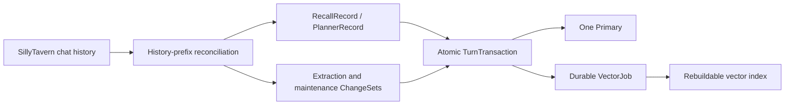

# ST-BME — SillyTavern Bionic Memory Ecology

> Let the AI remember your story—and return to the right past when that story is rewritten.

[中文](README.md) · **English**

ST-BME (Bionic Memory Ecology) is a third-party SillyTavern extension. It extracts characters, events, locations, rules, plot threads, and subjective knowledge from long chats into a visual memory graph, then recalls the most relevant information before the next generation.

v9 rewrites the stateful core. Chat history, graph changes, recall results, plot planning, and vector work now share one transaction model. When a floor is deleted or edited, a swipe is selected, or a response is rerolled, BME first identifies the active history branch and then decides exactly what to roll back or replay.

> [!IMPORTANT]
> v9 is a clean break. It does not read, migrate, or write back graphs, settings, message metadata, OPFS data, Luker data, shadow snapshots, or vector collections from v8 or earlier. Back up the old installation and its data before upgrading if you need to retain access to them.

## Core capabilities

- **Automatic memory extraction**: after an assistant response is committed, BME extracts structured nodes, relations, cognitive ownership, and story time according to the active settings.
- **Hybrid memory recall**: combines vector prefiltering, graph diffusion, lexical boosting, context blending, multi-intent retrieval, and optional LLM reranking into the final injection text.
- **Reliable history rollback**: edits, deletes, and selecting an existing swipe locate the history fork and undo only the transaction suffix after it.
- **Stable rerolls**: regenerate, new-swipe generation, and continue replay the parent user's persisted RecallRecord exactly when no new user turn exists.
- **Cognitive memory model**: supports objective world knowledge, character POV, user POV, regions, temporal relations, summaries, and reflections.
- **Automatic maintenance**: consolidation, hierarchical summaries, reflection, sleep cycles, and compression commit as separate stages so one failure cannot corrupt earlier completed work.
- **Plot planning**: ENA is BME's optional internal plot planner. It is disabled by default and runs only for a fresh user send after explicit enablement.
- **Visualization and management**: includes a Canvas graph, node editing, transaction records, graph import/export, graph clearing, and vector rebuilding.
- **Two persistence Primaries**: IndexedDB is the default; ST-Delegation-of-authority can provide the Authority Primary.

## Fresh sends, rerolls, and history changes

| Operation | Recall behavior | ENA behavior | Durable result |
| --- | --- | --- | --- |
| Fresh user send | Creates a new RecallRecord | Runs only when explicitly enabled | RecallRecord; PlannerRecord only when ENA ran |
| Regenerate / generate a new swipe / continue | Replays the parent user's RecallRecord exactly; retrieves again only if the record is missing or invalid | Never runs and never reads an old PlannerRecord | No temporary handoff state |
| Edit / delete / select an existing swipe | Reconciles the new history prefix, then rolls back post-fork records and graph changes | Post-fork PlannerRecords are removed too | Pre-fork transactions remain intact |
| Switch chats | Activates that chat's own state namespace | Cancels late planning from the previous chat | Async results cannot be written into the new chat |



The graph is business state; the vector index is derived data. If vector work fails, its committed VectorJob remains available for safe replay or rebuilding. Vectors never become a second graph source of truth.

## Installation

### Default installation: IndexedDB Primary

In SillyTavern, open “Extensions → Install Extension” and enter:

```text
https://github.com/Youzini-afk/ST-Bionic-Memory-Ecology
```

Refresh the page after installation. The defaults are: BME enabled, IndexedDB Primary, automatic extraction enabled, normal user recall enabled, and ENA disabled.

### Authority Primary

Authority mode also requires [ST-Delegation-of-authority](https://github.com/Youzini-afk/ST-Delegation-of-authority). Authority discovers BME's `.authority` module from the server extension directory when SillyTavern starts, so BME must be a physical directory at:

```text
SillyTavern/public/scripts/extensions/third-party/st-bme
```

Do not use a symlink or junction for `st-bme`, `.authority`, `module.json`, or `server.cjs`. Restart SillyTavern after installing or updating both plugins, select `authority` in BME settings, and reload the page.

The two Primaries do not migrate data, dual-write, or copy data automatically. If Authority is unavailable, BME reports the selected Primary as blocked instead of silently falling back to IndexedDB.

## Quick start

1. Open a chat and click the BME button in the bottom-right corner.
2. In Settings, confirm the Primary, automatic extraction, and normal recall options.
3. Configure the embedding transport, model, Task Profiles, and regex as needed. BME can still use graph and lexical signals without vectors, but recall quality will be reduced.
4. Chat normally. Assistant responses are extracted after commit; fresh user generations recall memory beforehand.
5. Enable ENA only when you want pre-send plot planning. Normal chat and rerolls do not depend on ENA.

## Panel

| Page or action | Purpose |
| --- | --- |
| Overview | Inspect the chat namespace, status, revision, processing progress, and record counts |
| Extract latest response | Force processing of the latest assistant response in the current chat |
| Rebuild vectors | Commit a durable rebuild job and refresh the current derived index |
| Graph | Browse nodes and relations; edit importance, archive state, and fields; or delete a node |
| Transaction records | Inspect RecallRecords, PlannerRecords, and pending VectorJobs |
| Export / import graph | Transfer a current v9 graph; only the current v9 export format is accepted |
| Clear graph | Clear the current chat graph as a transaction that follows history rollback |
| Settings | Manage Primary, ENA, extraction, recall, embedding, Task Profiles, and regex |

Changes to Primary, enabled state, or prompt injection position require a page reload. Other settings apply after saving.

## Storage and consistency

- The IndexedDB Primary uses the new `STBME_v9` database with an isolated namespace per chat.
- The Authority Primary commits SQL state transactions through BME's `.authority` module and keeps derived Trivium vectors in a separate `bme-v9:` namespace.
- Settings are stored in SillyTavern under `extension_settings.st_bme_v9`.
- RecallRecords and PlannerRecords belong to the Primary and are not written into chat-message `message.extra`.
- The Primary is pinned at page startup; a change takes effect only after saving and reloading.
- A Primary failure never triggers runtime switching, dual writes, or automatic data copying.

## Frequently asked questions

### My old graph disappeared after updating

This is expected for the v9 clean break. The old database is not read as a v9 Primary and is not migrated automatically. v9 graph import accepts only the v9 export format.

### Why does reroll not call ENA again?

This is an explicit lifecycle rule. ENA plans fresh user input; a reroll must reuse the already-decided RecallRecord rather than replanning and changing the meaning of the same user floor.

### The Primary is marked blocked

Fix the selected Primary instead of waiting for an automatic fallback. IndexedDB requires working browser storage. Authority requires the Authority plugin, BME companion module, permissions, and `/api/plugins/authority` service to be available.

### Can BME work without embeddings?

It can continue using graph, lexical, and other available signals, but vector recall will be unavailable. Direct embedding requests may also be blocked by browser CORS policy.

## Documentation and development

- [Documentation index](docs/README.md)
- [v9 architecture baseline, data model, and acceptance matrix](docs/vnext/architecture.md)

```bash
npm ci
npm run check
npm test
```

Real-host testing must use an isolated SillyTavern data directory, port, and test chat. Never reuse a personal instance.

## License

[GNU AGPL-3.0](LICENSE)
