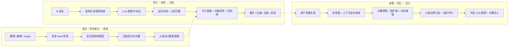

# ST-BME — SillyTavern 仿生记忆生态

> 让 AI 真正记住你们的故事。

ST-BME（Bionic Memory Ecology）是一个 **SillyTavern 第三方前端扩展**。它会把长期聊天中出现的角色、事件、地点、规则、主线、反思和总结抽取成一张可视化记忆图谱，并在下一轮生成前自动召回最相关的记忆注入 prompt。

---

## 目录

- [核心能力](#核心能力)
- [工作原理](#工作原理)
- [安装](#安装)
- [快速上手](#快速上手)
- [面板导览](#面板导览)
- [主要配置](#主要配置)
- [记忆模型](#记忆模型)
- [长聊天与历史安全](#长聊天与历史安全)
- [常用操作速查](#常用操作速查)
- [数据存储与同步](#数据存储与同步)
- [排障指南](#排障指南)
- [开发者参考](#开发者参考)
- [已知限制](#已知限制)
- [License](#license)

---

## 核心能力

- **自动记忆提取**
  - AI 回复后自动读取对话上下文，提取结构化节点和关系。
  - 支持角色、事件、地点、规则、主线、反思、主观记忆等类型。
  - 默认排除 `think`、`analysis`、`reasoning` 等推理标签，避免污染记忆。

- **多层混合召回**
  - 生成前自动召回相关记忆。
  - 检索链路包含向量预筛、图扩散、词法增强、上下文混合查询、多意图拆分、DPP 多样性采样和可选 LLM 精排。
  - 支持消息级持久召回卡片，可查看、编辑、删除、重新召回。

- **认知架构**
  - 支持角色 POV 记忆、用户 POV 记忆、客观世界记忆。
  - 支持空间区域、邻接区域、全局区域权重。
  - 支持故事时间线、时间桶、时间跨度和软引导。

- **总结与维护**
  - 支持小总结、总结折叠、反思、整合、自动压缩、主动遗忘。
  - 维护操作带日志和回滚能力，可撤销最近维护。

- **图谱可视化**
  - 内置 Canvas 力导向图谱。
  - 支持实时图谱、认知视图、总结视图、移动端图谱视图。
  - 支持主题切换、节点详情、子图召回卡片。

- **任务预设系统**
  - 提取、召回、压缩、小总结、总结折叠、反思、整合、规划都走统一 task profile。
  - 支持任务块排序、生成参数、全局正则、局部规则、世界书扫描和 EJS 渲染。

- **ENA Planner 集成**
  - ENA 规划器已整合到 ST-BME 配置页和 `planner` 任务预设。
  - 规划链路可使用角色卡、世界书、最近聊天、BME 记忆、历史 plot 和当前玩家输入。

- **持久化与同步**
  - 本地优先，主路径使用 IndexedDB。
  - 支持自动云端镜像和手动备份/恢复。
  - 支持导入、导出、重建、修复、压实和持久化探测。

- **历史安全**
  - 检测删楼、编辑、切 swipe 等历史变动。
  - 自动回滚受影响批次并从变动点恢复。
  - 对“聊天区只渲染最近 N 条”的截断视图有保护，避免误把渲染切片当成历史删除而清空运行时图谱。

- **长聊天优化**
  - 可隐藏旧楼层来控制上下文 token。
  - 可限制聊天区最多渲染最近 N 条，降低超长聊天前端卡顿。
  - 图布局、持久化 delta、快照 hydrate 支持 Native/Worker/WASM 灰度加速和 JS fail-open 回退。

---

## 工作原理

ST-BME 可以理解为三条链路：**写入**、**读取**、**安全**。



### 写入链路

1. **结构化消息**
   - 对话被规范为带楼层、角色、说话人、原文、来源类型的结构化消息。

2. **Assistant 边界过滤**
   - 默认排除推理标签内容。
   - 可自定义提取标签、排除标签和正则规则。

3. **分层上下文**
   - 提取 prompt 可以包含近期对话、图谱统计、活跃总结、故事时间、世界书和 Schema。

4. **LLM 提取**
   - 输出结构化图操作。
   - 自动解析新增、更新、合并、关系建立和主客观归属。

5. **后处理**
   - 向量同步。
   - 相似记忆整合。
   - 自动压缩。
   - 小总结与总结折叠。
   - 反思与主动遗忘。

### 读取链路

1. **召回输入解析**
   - 从当前用户输入、发送意图、生成生命周期或持久召回记录中解析召回目标。

2. **候选召回**
   - 向量预筛找语义相关节点。
   - 图扩散沿关系网络发现间接关联。
   - 词法增强补足实体名、地名、关键词匹配。

3. **排序与筛选**
   - 融合向量分、图分、重要性、时间新旧、访问强化、认知区域权重。
   - 可选多意图拆分、上下文混合查询、DPP 多样性采样、LLM 精排。

4. **注入**
   - 结果按当前状态、事件、反思锚点、规则约束等桶整理。
   - 注入到 SillyTavern prompt。
   - 同时可写入对应用户楼层的 `message.extra.bme_recall` 作为持久召回卡片。

### 安全链路

ST-BME 会为已处理消息记录 hash。发现历史被修改时，会找到最早受影响楼层，优先使用维护日志回滚并重放；无法安全回滚时才退化为全量重建。

---

## 安装

### 方法一：通过 SillyTavern 扩展安装

1. 打开 SillyTavern。
2. 进入扩展管理。
3. 选择安装第三方扩展。
4. 输入仓库地址：

```text
https://github.com/Youzini-afk/ST-Bionic-Memory-Ecology
```

5. 安装完成后刷新页面。

> 请粘贴仓库根地址，不要粘贴 GitHub 的子页面地址。

### 方法二：手动安装

进入 SillyTavern 的第三方扩展目录：

```bash
cd SillyTavern/data/default-user/extensions/third-party
git clone https://github.com/Youzini-afk/ST-Bionic-Memory-Ecology.git st-bme
```

然后重启或刷新 SillyTavern。

---

## 快速上手

1. **打开面板**
   - 左上角菜单中点击“记忆图谱”。
   - 或使用 ST-BME 注入的面板入口。

2. **启用插件**
   - 进入“配置 → 功能开关”。
   - 确认 ST-BME 主开关已启用。

3. **配置模型**
   - 记忆 LLM 留空时，会复用当前 SillyTavern 聊天模型。
   - 如果希望提取/总结/整合走独立模型，可在“API 配置”中填写 OpenAI-compatible 地址、Key 和模型名。

4. **配置 Embedding**
   - 推荐使用“后端模式”，复用 SillyTavern 已配置的向量 provider。
   - 也可以使用直连模式，但需要自行处理浏览器 CORS。

5. **开始聊天**
   - 正常对话即可。
   - AI 回复后自动提取，下一次生成前自动召回。

6. **查看结果**
   - “总览”看运行状态。
   - “任务 → 记忆浏览”看节点。
   - 图谱区域看关系网络。
   - 用户消息下方可能出现召回卡片，可展开查看召回子图。

> 最小可用配置：启用插件，并保证当前聊天模型可用。Embedding 不可用时，召回质量会明显下降，建议尽早配置。

---

## 面板导览

### 总览

- **活跃节点、边连接、已归档、碎片率**
- **当前聊天 ID**
- **历史状态**
- **向量状态**
- **最近恢复**
- **最近提取**
- **最近持久化**
- **最近向量**
- **最近召回**
- **认知 / 空间状态**

### 任务

任务页用于实时观察 ST-BME 的后台任务流。

- **管线总览**
  - 提取、召回、持久化、向量等阶段状态。

- **任务流水**
  - 最近任务的时间线和阶段结果。

- **记忆浏览**
  - 浏览、筛选、查看节点详情。

- **注入预览**
  - 查看当前构造出的注入文本和 token 估算。

- **消息追踪**
  - 追踪楼层、提取范围、召回来源和持久记录。

- **持久化**
  - 查看 IndexedDB、同步、恢复、sidecar、native hydrate 等诊断信息。

### 操作

- **重新提取**
  - `提取未处理`：只处理还没提取的助手楼层。
  - `重新提取范围`：按起止楼层重跑指定范围。

- **手动压缩**
  - 对冗余或相似记忆做压缩。

- **生成小总结**
  - 基于近期原文窗口生成阶段性总结。

- **执行总结折叠**
  - 将多条活跃总结折叠成更高层总结。

- **重建总结状态**
  - 根据提取批次重建总结状态。

- **强制进化**
  - 让新记忆主动影响旧记忆。

- **执行遗忘**
  - 降低长期未使用节点的优先级或归档。

- **撤销最近维护**
  - 回滚最近一次可撤销的维护动作。

- **重建向量 / 范围重建 / 直连重嵌**
  - 重建节点向量，修复召回质量或切换向量模型后的不一致。

- **导出 / 导入 / 重建图谱**
  - 图谱管理与危险操作。

- **持久化修复**
  - 重试持久化、重新探测图谱、重建本地缓存、修复/压实主 sidecar。

### 配置

配置页包含以下工作区：

- **API 配置**
  - 记忆 LLM。
  - Embedding 后端模式/直连模式。

- **功能开关**
  - 提取、召回、整合、总结、反思、压缩、遗忘、概率召回等主能力。
  - 云端存储模式。
  - 世界书过滤。
  - 隐藏旧楼层与聊天区渲染限制。

- **详细参数**
  - 提取频率、上下文窗口、召回 Top-K、图扩散、认知权重、维护阈值等。

- **任务预设**
  - 每个任务类型的 prompt blocks、生成参数、正则、世界书、EJS 模板。

- **ENA 规划器**
  - ENA Planner 的 API、模型、规划配置和任务预设入口。

- **面板外观**
  - 主题、通知样式、调试日志、Native 性能加速。

- **数据清理**
  - 本地缓存、遗留数据、调试状态等清理入口。

### 图谱区域

桌面端会显示实时图谱区域。移动端提供子视图切换：

- **实时图谱**
- **认知视图**
- **总结视图**

---

## 主要配置

### 记忆 LLM

记忆 LLM 用于：

- 提取记忆。
- 召回精排。
- 整合。
- 压缩。
- 小总结。
- 总结折叠。
- 反思。
- ENA Planner 规划。

配置方式：

- **留空**
  - 复用当前 SillyTavern 聊天模型。

- **填写 OpenAI-compatible 配置**
  - 使用独立模型处理记忆任务。
  - 适合把主聊天模型和后台维护模型分开。

安全建议：

- 不要把包含 API Key 的 `extension_settings` 或浏览器存储导出后公开。
- 调试日志默认关闭，需要排障时再临时开启。

### Embedding

Embedding 是智能召回的核心。

#### 后端模式

推荐优先使用后端模式：

- 复用 SillyTavern 后端的 embedding provider。
- 通常不需要浏览器直接持有 embedding API Key。
- 可使用 SillyTavern 已支持的 OpenAI、Cohere、Mistral、Ollama、LlamaCpp、vLLM 等来源。

#### 直连模式

直连模式由浏览器直接请求 embedding 服务：

- 需要填写 API 地址、Key 和模型。
- 可能遇到 CORS 限制。
- 适合自建网关或独立 embedding 服务。

> 切换 embedding 模式或模型后，建议执行“重建向量”。

### 提取设置

| 设置 | 默认 | 说明 |
| --- | --- | --- |
| 每 N 条回复提取 | `1` | 每几条助手回复触发一次提取 |
| 提取上下文轮数 | `2` | 提取时向前看的对话轮数 |
| 自动延后最新助手 | `false` | 可让最新回复稳定后再提取 |
| Assistant 排除标签 | `think,analysis,reasoning` | 默认排除推理标签 |
| 提取消息上限 | `0` | `0` 表示不限 |
| 提取 Prompt 结构模式 | `both` | 同时提供 transcript 和 structured messages |
| 提取世界书模式 | `active` | 复用当前激活世界书上下文 |
| 包含故事时间 | `true` | 提取时提供故事时间线 |
| 包含总结快照 | `true` | 提取时提供活跃总结 |
| 手动提取模式 | `pending` | 面板中的提取模式默认值 |

### 召回设置

| 设置 | 默认 | 说明 |
| --- | --- | --- |
| 启用召回 | `true` | 生成前自动检索记忆 |
| 向量预筛 | `true` | 先用 embedding 找候选 |
| 图扩散 | `true` | 沿图关系扩散相关节点 |
| LLM 精排 | `true` | 让 LLM 从候选中筛最终结果 |
| 召回 Top-K | `20` | 向量预筛数量 |
| 最终节点上限 | `12` | 注入前最多保留节点数 |
| 图扩散 Top-K | `100` | 图扩散候选数量 |
| LLM 候选池 | `30` | 进入精排的候选池大小 |
| 多意图拆分 | `true` | 一条输入拆成多个检索意图 |
| 上下文混合查询 | `true` | 融合当前输入、上一轮助手、前一条用户消息 |
| 词法增强 | `true` | 关键词精确匹配加权 |
| 时序链接 | `true` | 临近时间节点互相增强 |
| 多样性采样 | `true` | 避免召回结果过于同质 |

### 认知与空间设置

| 设置 | 默认 | 说明 |
| --- | --- | --- |
| Scoped Memory | `true` | 启用作用域记忆 |
| POV Memory | `true` | 启用角色/用户视角记忆 |
| 区域目标 | `true` | 区分当前区域、邻接区域、全局 |
| 认知记忆 | `true` | 启用主客观认知归属 |
| 空间邻接 | `true` | 地区之间可建立邻接关系 |
| 故事时间线 | `true` | 启用故事时间标签 |
| 注入故事时间标签 | `true` | 在注入中提示当前故事时间 |
| 软时间引导 | `true` | 以提示方式引导，不强制改写 |

### 维护设置

| 设置 | 默认 | 说明 |
| --- | --- | --- |
| 启用整合 | `true` | 相似/冲突记忆分析与合并 |
| 整合阈值 | `0.85` | 相似度触发阈值 |
| 启用小总结 | `true` | 兼容旧 `synopsis` 名称 |
| 启用层级总结 | `true` | 使用小总结 + 折叠的总结体系 |
| 小总结频率 | `3` | 每几次提取生成小总结 |
| 总结折叠扇入 | `3` | 同层总结达到几条后折叠 |
| 启用智能触发 | `false` | 只在高信息量场景增强提取 |
| 启用主动遗忘 | `false` | 周期性降低低价值节点 |
| 启用概率召回 | `false` | 少量弱相关记忆按概率入围 |
| 启用反思 | `true` | 周期性总结长期趋势 |
| 启用自动压缩 | `true` | 按提取周期压缩同类记忆 |

### 任务预设与正则清理

任务预设类型：

- **`extract`**
  - 记忆提取。

- **`recall`**
  - 召回精排。

- **`compress`**
  - 记忆压缩。

- **`synopsis`**
  - 小总结生成。

- **`summary_rollup`**
  - 总结折叠。

- **`reflection`**
  - 长期反思。

- **`consolidation`**
  - 记忆整合。

- **`planner`**
  - ENA Planner 规划。

正则清理用于减少污染标签进入提取、召回和注入：

- `thinking` / `think` / `analysis` / `reasoning`
- `choice`
- `UpdateVariable`
- `status_current_variable`
- `StatusPlaceHolderImpl`

用户可以在“任务预设”中调整全局正则和任务局部规则。显式保存为空规则时，插件不会自动把默认规则加回去。

### ENA Planner

ENA Planner 现在通过 `planner` 任务预设接入。它可以使用：

- 角色卡块。
- 世界书块。
- 最近聊天块。
- BME 召回记忆块。
- 历史 `<plot>` 块。
- 当前玩家输入块。

建议：

- 在“配置 → ENA 规划器”中配置基础 API 和启用状态。
- 在“配置 → 任务预设 → planner”中调整规划 prompt 结构和生成参数。

### 隐藏旧楼层与渲染限制

这是两个不同功能：

- **隐藏旧楼层**
  - 用于控制上下文 token。
  - 不删除聊天内容。
  - 通过酒馆隐藏机制让较早楼层不再参与主回复和 ST-BME 读取。

- **限制聊天区渲染楼层**
  - 用于减少超长聊天界面卡顿。
  - 同步到 SillyTavern 的 `chat_truncation`。
  - 只控制前端最多加载最近多少条。
  - 不等于上下文隐藏，也不等于删除消息。

重要提示：

- 如果你要对很早的楼层做“重新提取范围”或完整历史恢复，建议临时关闭渲染限制或调大数量并刷新。
- 当 ST-BME 检测到当前 `context.chat` 很可能只是最近 N 条渲染切片时，会暂停破坏性历史恢复，避免误清空运行时图谱。

### Native 性能加速

Native 加速目前是灰度能力，覆盖：

- 图布局。
- Persist Delta。
- 快照 Hydrate。

默认策略：

- 按节点、边、记录数、结构变化和序列化体积阈值自动命中。
- `Fail-open` 默认开启，Native 不可用或失败时回退 JS。
- 可以通过“全局强制关闭 Native”统一回退 JS。

---

## 记忆模型

### 节点类型

| 类型 | 说明 | 示例 |
| --- | --- | --- |
| 角色 | 角色状态、性格、外貌、能力变化 | “艾琳左肩受伤，暂时无法举弓” |
| 事件 | 已发生的剧情事件 | “两人在钟楼顶层达成约定” |
| 地点 | 地点状态和环境信息 | “旧实验室的北门被封住” |
| 规则 | 世界观设定、系统规则、约束 | “血契会在月蚀时失效” |
| 主线 | 任务线、剧情线、目标 | “寻找失踪的王冠碎片” |
| 全局概要 | 兼容旧概要体系的兜底节点 | “此前剧情摘要” |
| 反思 | 长期模式、叙事建议、关系趋势 | “二人遇到压力时倾向于互相隐瞒” |
| 主观记忆 | 某角色/用户视角中的信念、误解、情绪 | “她误以为对方背叛了自己” |

### 关系类型

图谱会建立参与、发生在、推动、矛盾、更新、时序更新、引用、归属等关系，让召回不只依赖单点相似度，而能沿剧情网络扩散。

### 主客观分层

- **客观层**
  - 世界事实、事件、地点、规则、主线。

- **角色 POV**
  - 角色知道什么、误解什么、相信什么、在意什么。

- **用户 POV**
  - 玩家/用户视角下需要保留的偏好、承诺、视角信息。

### 故事时间线

每条记忆可带有：

- 当前。
- 近过去。
- 远过去。
- 闪回。
- 未来预告。
- 时间跨度。

这些信息会影响召回排序和注入提示。

---

## 长聊天与历史安全

### 历史变动恢复

当你执行以下操作时：

- 删除消息。
- 编辑消息。
- 切换 swipe。
- 重跑某段提取。

ST-BME 会：

1. 对比已处理消息 hash。
2. 找到最早受影响楼层。
3. 清空可能失效的注入。
4. 回滚受影响批次中的节点、边和向量。
5. 从变动点重放提取。
6. 更新持久化快照。

如果维护日志不足以安全回滚，会进入全量重建路径。全量重建较慢，但优先保证正确性。

### 渲染限制保护

长聊天中如果开启“限制聊天区渲染楼层”，SillyTavern 可能只把最近 N 条消息暴露给前端上下文。这样 `context.chat.length` 会短于真实聊天。

ST-BME 已加入保护：

- 当图谱显示已处理到更高楼层，但当前可见 chat 只有最近 N 条时，不会立刻判断为“历史被删除”。
- `inspectHistoryMutation()` 会跳过这类渲染切片误判。
- `recoverHistoryIfNeeded()` 会暂停破坏性恢复，避免 full-rebuild 清空运行时图谱。
- 面板会提示你关闭/调大渲染限制后再做完整提取或恢复。

### Restore Lock

以下操作期间，ST-BME 会进入恢复锁：

- 手动重建图谱。
- 导入图谱。
- 重建总结状态。
- 云端恢复。
- 回滚上次恢复。

恢复锁期间会暂停自动提取、历史恢复、持久化重试和部分召回失效处理，避免并发写入破坏数据一致性。

---

## 常用操作速查

| 操作 | 位置 | 说明 |
| --- | --- | --- |
| 重新提取 | 操作 → 记忆操作 | 提取未处理楼层或重跑指定范围 |
| 手动压缩 | 操作 → 记忆操作 | 合并冗余高层节点 |
| 生成小总结 | 操作 → 记忆操作 | 为近期原文窗口生成阶段性总结 |
| 执行总结折叠 | 操作 → 记忆操作 | 把多条活跃总结折叠成更高层总结 |
| 重建总结状态 | 操作 → 记忆操作 | 从提取批次重建 summaryState |
| 强制进化 | 操作 → 记忆操作 | 让新记忆主动影响旧记忆 |
| 执行遗忘 | 操作 → 记忆操作 | 归档或降权低价值节点 |
| 撤销最近维护 | 操作 → 记忆操作 | 回滚最近可撤销维护 |
| 重建向量 | 操作 → 向量操作 | 重建全部节点 embedding |
| 范围重建 | 操作 → 向量操作 | 只重建指定楼层范围相关节点 |
| 直连重嵌 | 操作 → 向量操作 | 使用直连 embedding 配置重嵌 |
| 导出图谱 | 操作 → 图谱管理 | 下载当前图谱 JSON |
| 导入图谱 | 操作 → 图谱管理 | 导入图谱，建议随后重建向量 |
| 重建图谱 | 操作 → 图谱管理 | 危险操作：清空后从当前聊天重提 |
| 备份到云端 | 配置 → 功能开关 → 云端存储模式 | 手动模式下主动上传备份 |
| 从云端获取备份 | 配置 → 功能开关 → 云端存储模式 | 手动模式下主动恢复备份 |
| 取消全部隐藏 | 配置 → 功能开关 → 隐藏旧楼层 | 恢复当前聊天由 ST-BME 隐藏的楼层 |

---

## 数据存储与同步

### 本地主存储

- 主存储使用 IndexedDB。
- 数据库按聊天隔离，命名类似 `STBME_{chatId}`。
- 热路径使用增量提交，避免整图替换。
- 加载时优先从本地数据库恢复图谱。

### 云端镜像

云端同步使用 SillyTavern 已有文件 API，不需要自定义后端路由。

- 自动模式：
  - 本地写入后按当前镜像逻辑同步。

- 手动模式：
  - 本地写入仍正常进行。
  - 不自动写云端。
  - 需要点击“备份到云端”或“从云端获取备份”。

### 兼容与兜底

- 旧版 `chat_metadata.st_bme_graph` 仅作为迁移和兜底来源。
- shadow snapshot 和 metadata-full 是 recoverable 锚点，不是首选主存储。
- tombstone 用于同步删除状态，避免旧数据复活。
- 插件设置存放在 SillyTavern 的 `extension_settings.st_bme`。
- 消息级召回存放在对应用户消息的 `message.extra.bme_recall`。

### 持久召回卡片

带有有效 `message.extra.bme_recall` 的用户消息会显示召回卡片：

- 展开后可查看召回文本。
- 可查看召回子图。
- 可点击节点查看详情。
- 可编辑注入文本。
- 可删除持久召回。
- 可重新召回并覆盖记录。

优先级：

1. 本轮有新召回成功时，使用新召回并写回目标用户楼层。
2. 本轮无新召回时，从当前生成对应用户楼层读取持久召回作为回退。
3. 两者都没有时，清空注入。

---

## 排障指南

### 面板打不开

- 刷新 SillyTavern 页面。
- 确认扩展目录包含 `manifest.json`、`index.js`、`style.css`。
- 打开浏览器控制台搜索 `[ST-BME]`。
- 检查是否有其他扩展覆盖了左上角菜单结构。

### 没有自动提取

- 确认插件已启用。
- 确认当前聊天已有助手回复。
- 查看“总览 → 最近提取”和“任务 → 管线总览”。
- 检查记忆 LLM 是否可用。
- 如果开启智能触发，确认当前内容满足触发条件。
- 如果处于恢复锁或持久化加载中，等待状态恢复。

### 召回质量差

- 配置或修复 Embedding。
- 执行“重建向量”。
- 检查召回 Top-K、最终节点上限、LLM 精排是否开启。
- 检查节点是否过多过散，可执行整合或压缩。
- 查看消息级召回卡片确认实际注入内容。

### 旧楼层隐藏后模型仍看到太多内容

- “限制聊天区渲染楼层”只减少前端加载，不负责节省 token。
- 真正控制上下文需要开启“隐藏旧楼层”。
- 设置修改后可点击“重新应用当前隐藏”。

### 手动提取时提示历史恢复暂停

通常是因为开启了“限制聊天区渲染楼层”，当前前端只加载了最近 N 条。

处理方式：

1. 临时关闭“限制聊天区渲染楼层”，或把 N 调大到覆盖需要处理的范围。
2. 刷新当前聊天。
3. 再执行“提取未处理”或“重新提取范围”。

这是保护机制，不代表图谱丢失。

### 节点看起来突然清空

- 先刷新页面。
- 如果刷新后恢复，通常是运行时状态暂时不一致，持久化图谱没有丢。
- 查看“总览 → 最近恢复”和“任务 → 持久化”。
- 不要立刻执行“重建图谱”，除非确认要从聊天记录重新生成全部记忆。

### 召回卡片不显示

- 确认目标楼层是用户消息。
- 确认 `message.extra.bme_recall.injectionText` 非空。
- 第三方主题需要保留 `#chat .mes` 消息节点和稳定楼层索引属性，例如 `mesid`、`data-mesid` 或 `data-message-id`。
- 打开调试日志后搜索 `[ST-BME] Recall Card UI`。

### 直连 Embedding 失败

- 检查 API 地址和模型名。
- 检查 Key。
- 检查浏览器 CORS。
- 优先尝试后端模式。

---

## 开发者参考

### 目录结构

```text
ST-BME/
├── index.js                       # 主入口：事件绑定、流程调度、历史恢复、持久化协调
├── manifest.json                  # SillyTavern 扩展清单
├── style.css                      # 扩展样式
├── package.json                   # 测试与开发脚本
│
├── graph/                         # 图数据模型与领域状态
│   ├── graph.js                   # 节点/边 CRUD、序列化、迁移
│   ├── graph-persistence.js       # 持久化常量、加载状态、身份别名
│   ├── schema.js                  # 节点和关系 Schema
│   ├── memory-scope.js            # 主客观作用域与空间区域
│   ├── knowledge-state.js         # 认知归属、可见性、区域状态
│   ├── story-timeline.js          # 故事时间线
│   ├── summary-state.js           # 活跃总结状态
│   └── node-labels.js             # 节点显示名工具
│
├── maintenance/                   # 写入链路
│   ├── extractor.js               # LLM 提取管线
│   ├── extraction-controller.js   # 自动/手动提取编排
│   ├── extraction-context.js      # 结构化消息和边界过滤
│   ├── chat-history.js            # 楼层、hash、历史恢复工具
│   ├── consolidator.js            # 记忆整合
│   ├── compressor.js              # 压缩与遗忘
│   ├── hierarchical-summary.js    # 小总结和折叠总结
│   ├── smart-trigger.js           # 智能触发
│   └── task-graph-stats.js        # 任务图谱统计
│
├── retrieval/                     # 读取链路
│   ├── retriever.js               # 召回编排
│   ├── shared-ranking.js          # 共享排序核心
│   ├── recall-controller.js       # 召回输入和注入控制
│   ├── recall-persistence.js      # 消息级召回持久化
│   ├── retrieval-enhancer.js      # 多意图、DPP、残差召回
│   ├── diffusion.js               # 图扩散
│   ├── dynamics.js                # 混合评分与访问强化
│   └── injector.js                # 注入格式化
│
├── prompting/                     # Prompt 与任务预设
│   ├── prompt-builder.js
│   ├── prompt-profiles.js
│   ├── default-task-profile-templates.js
│   ├── prompt-node-references.js
│   ├── task-regex.js
│   ├── task-worldinfo.js
│   ├── task-ejs.js
│   ├── injection-sanitizer.js
│   └── mvu-compat.js
│
├── llm/                           # LLM 请求封装
│   ├── llm.js
│   └── llm-preset-utils.js
│
├── vector/                        # 向量索引与直连 Embedding
│   ├── vector-index.js
│   └── embedding.js
│
├── runtime/                       # 运行时状态和设置
│   ├── runtime-state.js
│   ├── settings-defaults.js
│   ├── generation-options.js
│   ├── planner-tag-utils.js
│   ├── request-timeout.js
│   ├── runtime-debug.js
│   ├── debug-logging.js
│   └── user-alias-utils.js
│
├── sync/                          # 持久化与同步
│   ├── bme-db.js                  # IndexedDB 数据层
│   ├── bme-opfs-store.js          # OPFS/sidecar 存储
│   ├── bme-sync.js                # 云端镜像与备份恢复
│   └── bme-chat-manager.js        # chatId → 数据库生命周期
│
├── host/                          # SillyTavern 宿主适配
│   ├── event-binding.js
│   ├── runtime-host-adapter.js
│   ├── st-context.js
│   ├── st-native-render.js
│   └── adapter/
│
├── ui/                            # 面板、图谱和消息级 UI
│   ├── panel.html
│   ├── panel.js
│   ├── panel-bridge.js
│   ├── panel-ena-sections.js
│   ├── ui-actions-controller.js
│   ├── ui-status.js
│   ├── graph-renderer.js
│   ├── graph-layout-solver.js
│   ├── graph-native-bridge.js
│   ├── recall-message-ui.js
│   ├── hide-engine.js
│   ├── notice.js
│   └── themes.js
│
├── ena-planner/                   # ENA Planner
├── native/                        # Native/WASM 源码与构建产物相关目录
├── vendor/                        # vendored 依赖
├── lib/                           # 浏览器侧库文件
└── tests/                         # Node 回归测试与性能测试
```

### 本地开发

安装依赖：

```bash
npm install
```

语法检查：

```bash
npm run check
```

稳定测试集：

```bash
npm run test:stable
```

P0 回归：

```bash
npm run test:p0
```

持久化矩阵：

```bash
npm run test:persistence-matrix
```

IndexedDB 专项：

```bash
npm run test:indexeddb
```

Native/性能相关：

```bash
npm run test:native-layout-parity
npm run bench:graph-layout
npm run bench:persist-delta
npm run bench:persist-load
npm run bench:load-preapply
```

构建 Native WASM：

```bash
npm run build:native:wasm
```

更新 manifest 版本：

```bash
npm run version:bump-manifest
```

### 重要测试文件

- **`tests/p0-regressions.mjs`**
  - 主回归集合，覆盖提取、召回、恢复、UI 关键路径。

- **`tests/runtime-history.mjs`**
  - 消息 hash、历史 dirty、恢复状态。

- **`tests/message-render-limit.mjs`**
  - 聊天区渲染限制和渲染切片历史保护。

- **`tests/graph-persistence.mjs`**
  - 图谱持久化基础行为。

- **`tests/indexeddb-persistence.mjs`**
  - IndexedDB 快照、增量提交、hydrate。

- **`tests/indexeddb-sync.mjs`**
  - 云端同步与冲突合并。

- **`tests/native-rollout-matrix.mjs`**
  - Native 灰度开关和阈值迁移。

- **`tests/task-profile-migration.mjs`**
  - 任务预设迁移。

### 事件挂载

| SillyTavern 事件 | ST-BME 行为 |
| --- | --- |
| `CHAT_CHANGED` | 加载当前聊天图谱，恢复持久状态，应用隐藏/渲染限制 |
| `GENERATION_AFTER_COMMANDS` | 助手回复后触发自动提取 |
| `GENERATE_BEFORE_COMBINE_PROMPTS` | 生成前召回并注入 |
| `MESSAGE_SENT` | 捕获发送意图和权威用户输入 |
| `MESSAGE_RECEIVED` | 更新自动提取队列和持久化状态 |
| 编辑 / 删除 / Swipe | 检测历史变化并恢复 |

### 贡献注意事项

- 优先保持扩展侧实现，不要把核心能力依赖到自定义 SillyTavern server plugin。
- 修改中心抽象时，补充或更新对应测试。
- 涉及持久化、历史恢复、导入/恢复等路径时，优先防止空图覆盖和并发写入。
- 涉及 prompt 或正则迁移时，保留旧设置兼容。
- 提交前至少运行 `npm run check` 和相关专项测试。

---

## 已知限制

- **记忆质量依赖 LLM**
  - 提取模型理解错误时，记忆也会错误。

- **Embedding 决定召回下限**
  - 没有高质量向量，召回会更依赖词法和图结构。

- **直连模式可能受 CORS 影响**
  - 浏览器安全策略可能阻止请求。

- **超长聊天仍有成本**
  - 隐藏旧楼层、渲染限制、总结折叠可以降低压力，但不能消除所有开销。

- **历史恢复优先正确性**
  - 日志不足时会退化全量重建，可能较慢。

- **第三方主题可能影响召回卡片挂载**
  - 如果主题移除了标准消息 DOM 或楼层索引属性，卡片可能跳过挂载。

- **Native 加速是灰度能力**
  - 默认 fail-open，失败时回退 JS；遇到异常可在面板中强制关闭 Native。

---

## License

AGPLv3 — 详见 [LICENSE](./LICENSE)。
