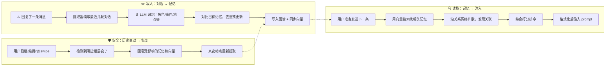

# 🧠 ST-BME — SillyTavern 图谱记忆插件

> **让 AI 真正记住你们的故事。**
>
> ST-BME 把对话中散落的角色、事件、地点、关系自动提取为记忆图谱，在下一轮生成前精准召回，让长期 RP 的角色不再"失忆"。

---

## ✨ 它能做什么

- 🧩 **自动提取** — 每次 AI 回复后，从上下文中抽取角色状态、事件、地点、规则、主线等结构化记忆
- 🔍 **智能召回** — 生成前根据当前对话自动检索最相关的记忆，注入 prompt
- 🌐 **图谱可视化** — 内置力导向图谱面板，直观查看记忆节点之间的关系
- 🎨 **4 套配色主题** — Crimson Synth / Neon Cyan / Amber Console / Violet Haze
- 📱 **手机端适配** — 底部 Tab Bar + 精简布局，手机也能用
- 🔄 **历史安全** — 删楼、编辑、切 swipe 时自动回滚恢复，不留脏记忆
- 📦 **不改酒馆本体** — 纯第三方扩展，即装即用

---

## 🧭 它是怎么工作的

整个插件可以拆成三件事：**写入**（把对话变成记忆）、**读取**（把记忆送回给 AI）、**安全**（出了问题能恢复）。



### 写入阶段（对话 → 记忆）

每次 AI 回复后，插件会把最近几轮对话打包发给 LLM（可以是你聊天用的同一个模型，也可以单独配一个），让它识别出"这段对话里出现了哪些角色、发生了什么事、在哪里、有什么新规则"等等。

识别出来的结果不是直接塞进去——插件会先跟已有记忆做对比（通过向量搜索找相似的），如果已经有了就更新，如果是真正的新内容才创建。

写入之后，还可能触发一些后续处理：
- **压缩** — 太多类似的事件记忆会被合并
- **进化** — 新信息会影响旧记忆的理解（比如"原来他当时是在演戏"）
- **概要** — 自动生成"之前发生了什么"的总结
- **遗忘** — 很久没被用到的记忆降低优先级

### 读取阶段（记忆 → 注入）

当你准备发送下一条消息时，插件会抢在 AI 生成之前做一轮"召回"：

1. **向量搜索** — 根据当前对话内容，用 Embedding 找到语义最相关的记忆
2. **图扩散** — 找到相关记忆后，沿着关系往外扩散（比如某个角色参与了某个事件，那个事件发生在某个地点...）
3. **混合评分** — 把向量相似度、图扩散能量、节点重要性、时间新旧综合排序
4. **格式化注入** — 选出最终入围的记忆，分类整理后注入到 prompt 里

注入的内容分成两层：
- **常驻层** — 规则、概要、主线这类始终需要的
- **动态层** — 根据当前对话语境召回的

### 安全机制（历史变动 → 恢复）

这是很多记忆插件忽略的问题：如果用户删了某条消息、编辑了内容、或者切了 swipe，已经基于那条消息提取的记忆就变成"脏"的了。

ST-BME 的处理方式是：
1. 给每条已处理的消息计算 hash（指纹）
2. 发现 hash 变了 → 找到最早受影响的位置
3. 把那之后产生的记忆和向量全部回滚
4. 从变动点重新走一遍提取流程

如果恢复日志损坏了，会退化为全量重建——慢一点但保证正确。

---

## 🚀 安装

### 方法一：通过 SillyTavern 扩展安装

1. 打开 SillyTavern → 扩展 → 安装扩展
2. 输入仓库地址：
   ```
   https://github.com/Youzini-afk/ST-Bionic-Memory-Ecology
   ```
   注意：请粘贴仓库根地址，不要使用像 `/graphs/code-frequency` 这样的 GitHub 子页面地址。
3. 刷新页面

### 方法二：手动安装

```bash
cd SillyTavern/data/default-user/extensions/third-party
git clone https://github.com/Youzini-afk/ST-Bionic-Memory-Ecology.git st-bme
```

重启 SillyTavern 即可。

---

## ⚡ 快速上手

1. **打开面板** — 左上角 ≡ 菜单 →「🧠 记忆图谱」
2. **启用插件** — 进入面板的「配置 → 功能开关」，打开 ST-BME 自动记忆
3. **配置 Embedding** — 进入「配置 → API 配置」，选择向量模式并填好模型
4. **开始聊天** — 正常跟角色对话，插件会自动在后台提取和召回

> **最少配置：** 只勾选"启用"就能跑起来。默认会复用你当前的聊天模型做提取。

---

## 📝 记忆类型

插件会把对话拆解成以下几种记忆节点：

| 类型 | 说明 | 举例 |
|------|------|------|
| 🧑 角色 | 角色的当前状态、性格、外貌变化 | "小明因为淋雨感冒了" |
| ⚡ 事件 | 发生过的事 | "河边的告白" |
| 📍 地点 | 地点状态 | "废弃实验室，门被锁上了" |
| 📌 规则 | 世界观设定、约束 | "魔法会消耗生命力" |
| 🧵 主线 | 任务线/剧情线 | "寻找失踪的项链" |
| 📜 概要 | 自动生成的前情提要 | — |
| 💭 反思 | 长期规律总结 | "他们经常在夕阳下聊天" |

这些节点之间还会建立关系（参与、发生在、推动、矛盾、更新等），形成一张完整的记忆网络。

---

## 🔧 设置说明

### 记忆 LLM

用来做提取、压缩、进化、概要等任务的模型。

- **留空** → 复用当前 SillyTavern 的聊天模型（最简配置）
- **填写** → 你可以指定一个独立的 OpenAI-compatible 模型专门处理记忆

### Embedding（向量搜索）

向量搜索是"智能召回"的关键。支持两种模式：

#### 后端模式（推荐）

走 SillyTavern 后端的向量 API，最稳定：

- 支持 OpenAI / Cohere / Mistral / Ollama / LlamaCpp / vLLM 等
- 在设置面板选择「后端向量源」，填好模型名即可
- 不需要单独填 API Key，复用酒馆已有的

#### 直连模式

如果你需要完全独立的 Embedding 服务（比如酒馆后端不支持的源）：

- 填入 Embedding API 地址、Key、Model
- 插件直接请求你的 Embedding 服务
- 注意浏览器跨域问题（CORS）

> **切换向量模式/模型后，建议点一次"重建向量"。**

### 提取设置

| 设置 | 默认 | 说明 |
|------|------|------|
| 每 N 条回复提取 | 1 | 每几条 AI 回复做一次提取 |
| 提取上下文轮数 | 2 | 提取时向前看几轮对话 |
| 启用近邻对照 | 开 | 写入前对比现有记忆，避免重复 |
| 启用记忆进化 | 开 | 新记忆会影响旧记忆理解 |
| 启用自动概要 | 开 | 定期生成前情提要 |
| 启用反思 | 关 | 让 AI 总结长期模式 |
| 启用主动遗忘 | 开 | 太久没用的记忆降低优先级 |

### 召回设置

| 设置 | 默认 | 说明 |
|------|------|------|
| 提取上下文轮数 | 2 | 按轮计的提取上下文，通常约等于向前补 4 层普通消息 |
| 向量预筛 Top-K | 20 | 向量预筛阶段最多保留多少个候选 |
| LLM 精排候选池 | 30 | 进入 LLM 精排阶段前的候选池大小 |
| LLM 最终选择上限 | 8 | LLM 精排后最多保留多少条记忆 |
| 图扩散 Top-K | 100 | 图扩散阶段最多保留多少个候选 |
| 注入深度 | 9999 | 当前走 IN_CHAT@Depth，数值越大越靠前插入 |
| Token 估算 | — | 注入内容的 token 估算（仅用于展示，当前版本不强制裁剪） |

---

## 🖥️ 操控面板

从左上角 ≡ 菜单点「🧠 记忆图谱」打开面板。

### 总览 Tab
- 统计数据（活跃节点、边、归档数、碎片率）
- 运行状态（聊天 ID、向量状态、历史状态）
- 最近提取 / 召回的记忆

### 记忆 Tab
- 搜索和筛选记忆节点
- 点击节点查看详情
- 支持按类型过滤

### 注入 Tab
- 预览当前注入内容
- 查看 token 消耗

### 操作 Tab
- 手动提取 — 立即从当前对话提取
- 手动压缩 — 合并重复/过时记忆
- 执行遗忘 — 主动降级低价值记忆
- 更新概要 — 重新生成前情提要
- 导出 / 导入图谱
- 重建图谱 — 从当前聊天重新提取全部记忆
- 重建向量 — 重建全部向量索引
- 强制进化 — 让新记忆影响旧记忆

### 配置 Tab
配置页现在是一个完整的工作区，分成 5 个子页：
- API 配置
- 功能开关
- 详细参数
- 系统提示词
- 面板外观

桌面端会显示左侧竖向子导航，右侧显示宽版配置表单；移动端则改成顶部横向子页切换。
检索流水线现在可以分别配置向量预筛、图扩散、混合评分和 LLM 精排。
注入深度使用 `IN_CHAT@Depth` 语义，默认 `9999` 表示尽量靠前插入，减少对最近几层对话的直接控制感。

### 图谱可视化
桌面端右侧大区域显示力导向图谱，节点可拖拽、缩放、点击查看详情。支持 4 套配色主题切换。

---

## 🔄 历史安全

这是最重要的功能之一。

当你在 SillyTavern 里做以下操作时：
- 删除某条消息
- 编辑某条消息
- 切换 swipe

插件会自动检测到历史发生了变化，然后：

1. **止损** — 停止当前推进，清空可能失效的注入
2. **回滚** — 找到受影响的批次，删除相关记忆和向量
3. **恢复** — 从变动点重新提取

这样你就不用担心"改了历史但记忆还留着错的内容"的问题。

---

## 📋 手动操作速查

| 操作 | 说明 |
|------|------|
| 手动提取 | 不等自动触发，立刻提取当前对话 |
| 手动压缩 | 把重复/冗余的事件合并 |
| 执行遗忘 | 降低长期未使用记忆的优先级 |
| 更新概要 | 重新生成全局前情提要 |
| 导出图谱 | 下载当前图谱 JSON（不含向量） |
| 导入图谱 | 导入图谱文件（导入后需重建向量） |
| 重建图谱 | ⚠️ 清空现有图谱，从聊天记录重新提取 |
| 重建向量 | 重建全部节点的向量索引 |
| 范围重建向量 | 只重建指定楼层范围内的向量 |
| 强制进化 | 让新记忆深度影响旧记忆认知 |

---

## 🏗️ 开发者参考

### 文件结构

```
ST-BME/
├── index.js           # 主入口：事件绑定、流程调度、历史恢复
├── graph.js           # 图数据模型、序列化、版本迁移
├── extractor.js       # 记忆提取、概要、反思
├── retriever.js       # 向量候选、图扩散、混合评分、召回
├── injector.js        # 召回结果格式化注入
├── runtime-state.js   # 运行时状态：楼层 hash、dirty 标记、恢复日志
├── recall-persistence.js # 持久召回记录（message.extra.bme_recall）
├── recall-message-ui.js # 消息级召回卡片 UI（子图渲染 + 侧边栏编辑）
├── vector-index.js    # 向量索引管理（backend / direct 双模式）
├── embedding.js       # 直连 Embedding API 封装
├── llm.js             # 记忆 LLM 请求封装
├── compressor.js      # 层级压缩与遗忘
├── evolution.js       # 记忆进化（A-MEM 风格）
├── diffusion.js       # 图扩散算法
├── dynamics.js        # 动态调节（重要度衰减等）
├── schema.js          # 节点类型定义
├── themes.js          # 4 套主题配色
├── graph-renderer.js  # Canvas 力导向图谱渲染器
├── panel.js           # 操控面板交互逻辑
├── panel.html         # 面板 HTML 模板
├── style.css          # 全部样式
├── manifest.json      # SillyTavern 扩展清单
└── tests/             # 测试脚本
```

### 数据存储

- **图谱数据** → `chat_metadata.st_bme_graph`（跟随聊天保存）
- **插件设置** → SillyTavern 的 `extension_settings.st_bme`
- **向量索引** → 后端模式走酒馆 API；直连模式存在节点内
- **召回持久注入** → `chat[x].extra.bme_recall`（消息级）

### 事件挂载

| SillyTavern 事件 | 做什么 |
|---|---|
| `CHAT_CHANGED` | 加载对应聊天的图谱 |
| `GENERATION_AFTER_COMMANDS` | AI 回复后提取记忆 |
| `GENERATE_BEFORE_COMBINE_PROMPTS` | 生成前召回并注入 |
| `MESSAGE_RECEIVED` | 保存图谱状态 |
| 删除 / 编辑 / Swipe | 触发历史变动检测与恢复 |

### 召回流水线

```
用户输入 → 向量预筛 → 图扩散 → 混合评分 → [可选 LLM 精排] → 场景重构 → 分桶注入
```

### 注入格式

召回结果分成两层注入：

- **Core**（常驻）：规则、概要、主线
- **Recalled**（动态）：根据当前对话召回

每层内进一步按用途分桶：当前状态 / 情景事件 / 反思锚点 / 规则约束。

### 持久召回注入（`message.extra.bme_recall`）

从本版本开始，召回注入支持消息级持久化，存放在对应用户楼层：

- 路径：`chat[x].extra.bme_recall`
- 主要字段：
  - `version`
  - `injectionText`
  - `selectedNodeIds`
  - `recallInput`
  - `recallSource`
  - `hookName`
  - `tokenEstimate`
  - `createdAt` / `updatedAt`
  - `generationCount`（**仅**在该持久注入被实际用作生成回退时递增）
  - `manuallyEdited`（仅表示来源是否为人工编辑）

注入优先级（避免双重注入）：

1. **本轮有新召回成功**：仅使用新召回注入（临时注入），并覆盖写入目标用户楼层的 `bme_recall`。
2. **本轮无新召回结果**：仅从“当前生成对应的用户楼层”读取 `bme_recall` 作为回退注入。
3. **两者都无**：清空注入。

> `manuallyEdited` 不参与优先级判断，不会强制覆盖系统召回。

消息级 UI：

- 带有 `bme_recall` 的用户消息会显示内联卡片（含用户消息 + 🧠 召回条 + 记忆数 badge）。
- 点击召回条展开，显示**力导向子图**（仅渲染被召回的节点和它们之间的边，复用 `GraphRenderer`）。
- 子图中节点可拖拽/缩放，点击节点打开**右侧边栏**查看节点详情。
- 操作按钮（展开态底部）：
  - **✏️ 编辑**：打开侧边栏编辑注入文本（实时 token 计数），保存后标记 `manuallyEdited=true`。
  - **🗑 删除**：二次确认（按钮变红 3s 超时重置），确认后移除持久召回记录。
  - **🔄 重新召回**：重新执行召回并覆盖记录，`manuallyEdited` 重置为 `false`。
- 不再使用 `prompt()` / `alert()` / `confirm()` 浏览器原生对话框。

兼容性说明：

- 旧聊天（无 `extra` 或无 `bme_recall`）会自动按“无持久记录”处理，不会报错。
- badge 依赖酒馆消息 DOM 的楼层索引属性；若第三方主题重写消息结构，可能需要额外适配。

---

## ⚠️ 已知限制

1. **记忆质量取决于 LLM** — 模型提取不准，记忆也会不准
2. **直连模式有跨域风险** — 浏览器的 CORS 限制可能导致请求失败
3. **后端向量仅支持酒馆已有 provider** — 不在列表里的需要用直连
4. **恢复优先正确性** — 批次日志缺失时会退化为全量重建，可能较慢

---

## 📄 License

AGPLv3 — 详见 [LICENSE](./LICENSE)
