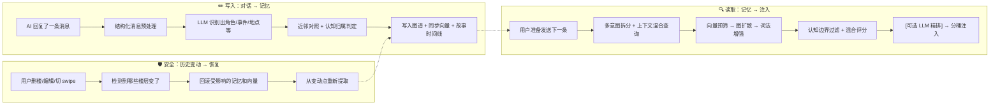

# 🧠 ST-BME — SillyTavern 仿生记忆生态

> **让 AI 真正记住你们的故事。**
>
> ST-BME 把对话中散落的角色、事件、地点、关系自动提取为记忆图谱，在下一轮生成前精准召回，让长期 RP 的角色不再"失忆"。

---

## ✨ 核心能力

- 🧩 **自动提取** — AI 回复后自动从上下文中抽取角色状态、事件、地点、规则、主线等结构化记忆
- 🔍 **多层混合召回** — 向量语义搜索 + 图扩散 + 词法增强 + 认知边界过滤 + 可选 LLM 精排，精准注入
- 🧠 **认知架构** — 主客观分层记忆、角色视角记忆、空间邻接感知、故事时间线，模拟真实认知
- 🌐 **图谱可视化** — 内置力导向图谱面板，直观查看记忆节点之间的关系
- 🎨 **4 套配色主题** — Crimson Synth / Neon Cyan / Amber Console / Violet Haze
- 📱 **手机端适配** — 底部 Tab Bar + 精简布局，手机也能用
- 🔄 **历史安全** — 删楼、编辑、切 swipe 时自动回滚恢复，不留脏记忆
- 🧹 **污染标签清理** — 默认清理 thinking/choice/UpdateVariable 等常见污染标签，可自定义正则
- 📦 **不改酒馆本体** — 纯第三方扩展，即装即用

---

## 🧭 工作原理

整个插件可以拆成三件事：**写入**（把对话变成记忆）、**读取**（把记忆送回给 AI）、**安全**（出了问题能恢复）。



### 写入阶段（对话 → 记忆）

每次 AI 回复后，插件会把最近几轮对话打包发给 LLM（可以是你聊天用的同一个模型，也可以单独配一个），让它识别出"这段对话里出现了哪些角色、发生了什么事、在哪里、有什么新规则"等等。

**提取管线预处理**：

1. **结构化消息** — 对话被规范为带 `seq/role/speaker/name/rawContent/sourceType` 的结构化消息
2. **Assistant 边界过滤** — 默认排除 `think/analysis/reasoning` 等推理标签内容，可自定义提取/排除规则
3. **分层上下文** — 对话切片、图谱状态、总结快照、故事时间线、Schema 定义作为独立上下文字段传给 LLM
4. **世界书集成** — 提取时可选择是否解析世界书内容，复用酒馆原生世界书扫描逻辑

识别出来的结果不是直接塞进去——插件会先跟已有记忆做对比（通过向量搜索找相似的），如果已经有了就更新，如果是真正的新内容才创建。同时会判定记忆的**认知归属**（角色视角/用户视角/客观）和**空间区域**。

写入之后，还可能触发一些后续处理：

- **整合** — 相似记忆合并（Mem0 精确对照 + A-MEM 进化）
- **压缩** — 太多类似的事件记忆会被层级合并
- **层级总结** — 基于近期原文窗口生成小总结，并在前沿过厚时继续做总结折叠
- **反思** — 长期模式总结，生成叙事指导原则
- **遗忘** — 很久没被用到的记忆降低优先级

### 读取阶段（记忆 → 注入）

当你准备发送下一条消息时，插件会抢在 AI 生成之前做一轮"召回"：

1. **多意图拆分** — 自动识别用户消息中的多个意图，分别检索
2. **上下文混合查询** — 融合当前用户输入 + 上一轮 AI 回复 + 前一条用户消息的加权查询
3. **向量预筛** — 用 Embedding 找到语义最相关的候选
4. **图扩散** — 沿关系网络向外扩散，发现间接关联
5. **词法增强** — 关键词精确匹配加权，弥补纯语义搜索的盲区
6. **认知边界过滤** — 按角色视角/用户视角/客观区域过滤和加权
7. **混合评分** — 向量相似度 × 图扩散能量 × 节点重要性 × 时间新旧 × 认知权重
8. **多样性采样** — DPP 采样避免召回内容过于同质
9. **[可选] LLM 精排** — 让 LLM 从候选池中挑选最相关的记忆
10. **格式化注入** — 选出最终入围的记忆，分类整理后注入到 prompt 里

注入的内容分成两层：

- **Core（常驻层）** — 规则、主线，以及在没有活跃总结前沿时兜底的旧式全局概要
- **Recalled（动态层）** — 根据当前对话语境召回的

每层内进一步按用途分桶：当前状态 / 情景事件 / 反思锚点 / 规则约束。

**召回 prompt 分段**：recall 的 LLM prompt 将 recentMessages 拆分为"上下文回顾"和"当前召回目标"两段 system message，帮助模型更好地区分参考信息和当前任务。

### 安全机制（历史变动 → 恢复）

这是很多记忆插件忽略的问题：如果用户删了某条消息、编辑了内容、或者切了 swipe，已经基于那条消息提取的记忆就变成"脏"的了。

ST-BME 的处理方式是：

1. 给每条已处理的消息计算 hash（指纹）
2. 发现 hash 变了 → 找到最早受影响的位置
3. 把那之后产生的记忆和向量全部回滚
4. 从变动点重新走一遍提取流程

如果恢复日志损坏了，会退化为全量重建——慢一点但保证正确。

**持久化稳态保障**：

- IndexedDB 热路径走增量提交（`buildPersistDelta`），不再整图替换
- `accepted/recoverable` 语义分层：只有 IndexedDB 和 chat-state 计入 accepted；shadow 与 metadata-full 仅为 recoverable 恢复锚点
- Restore Lock 门禁：手动重建/导入/云恢复等操作期间，自动提取/召回/持久化重试自动暂停

---

## 🚀 安装

### 方法一：通过 SillyTavern 扩展安装

1. 打开 SillyTavern → 扩展 → 安装扩展
1. 输入仓库地址：

```text
https://github.com/Youzini-afk/ST-Bionic-Memory-Ecology
```

注意：请粘贴仓库根地址，不要使用像 `/graphs/code-frequency` 这样的 GitHub 子页面地址。

1. 刷新页面

### 方法二：手动安装

```bash
cd SillyTavern/data/default-user/extensions/third-party
git clone https://github.com/Youzini-afk/ST-Bionic-Memory-Ecology.git st-bme
```

重启 SillyTavern 即可。

---

## ⚡ 快速上手

1. **打开面板** — 左上角 ≡ 菜单 →「🧠 记忆图谱」
2. **启用插件** — 进入面板的「配置 → 功能开关」，打开 ST-BME 自动记忆
3. **配置 Embedding** — 进入「配置 → API 配置」，选择向量模式并填好模型
4. **开始聊天** — 正常跟角色对话，插件会自动在后台提取和召回

> **最少配置：** 只勾选"启用"就能跑起来。默认会复用你当前的聊天模型做提取。

---

## 📝 记忆类型

插件会把对话拆解成以下几种记忆节点：

| 类型 | 说明 | 举例 |
| ------ | ------ | ------ |
| 🧑 角色 | 角色的当前状态、性格、外貌变化 | "小明因为淋雨感冒了" |
| ⚡ 事件 | 发生过的事 | "河边的告白" |
| 📍 地点 | 地点状态 | "废弃实验室，门被锁上了" |
| 📌 规则 | 世界观设定、约束 | "魔法会消耗生命力" |
| 🧵 主线 | 任务线/剧情线 | "寻找失踪的项链" |
| 📜 全局概要（旧） | 单条全局前情提要，现主要用于兼容 / 迁移兜底 | — |
| 💭 反思 | 长期规律总结 | "他们经常在夕阳下聊天" |
| 👁️ 主观记忆 | 角色视角下的记忆，含误解和情绪 | "她以为他离开了，其实他躲起来了" |

这些节点之间还会建立关系（参与、发生在、推动、矛盾、更新、时序更新等），形成一张完整的记忆网络。

### 认知架构

ST-BME 的记忆不是扁平的——它模拟了真实的认知分层：

**主客观分层**：

- **客观层** — 事件、地点、规则等事实性记忆，按空间区域组织
- **主观层（POV）** — 角色视角记忆，包含信念、情绪、态度，甚至允许"误解"（`certainty: mistaken`）

**空间感知**：

- 记忆按空间区域归属（当前区域/邻接区域/全局）加权召回
- 角色移动时，相关区域的记忆权重自动调整

**故事时间线**：

- 每条记忆带有故事时间标记（当前/近过去/远过去/闪回/未来）
- 时间线上下文可注入 prompt，帮助模型保持时间感知
- 支持软引导（`storyTimeSoftDirecting`），不强制但提示模型注意时间流

### 总结状态

当前主用的总结体系不是 `synopsis` 节点，而是 `summaryState` 中持续演化的「小总结 + 总结折叠」活跃前沿。

---

## 🔧 设置说明

### 记忆 LLM

用来做提取、压缩、整合、小总结、总结折叠、反思等任务的模型。

- **留空** → 复用当前 SillyTavern 的聊天模型（最简配置）
- **填写** → 你可以指定一个独立的 OpenAI-compatible 模型专门处理记忆
- **自动检测** → 插件会自动检测是否配置了专用的记忆 LLM 提供商

### Embedding（向量搜索）

向量搜索是"智能召回"的关键。支持两种模式：

#### 后端模式（推荐）

走 SillyTavern 后端的向量 API，最稳定：

- 支持 OpenAI / Cohere / Mistral / Ollama / LlamaCpp / vLLM 等
- 在设置面板选择「后端向量源」，填好模型名即可
- 不需要单独填 API Key，复用酒馆已有的

#### 直连模式

如果你需要完全独立的 Embedding 服务（比如酒馆后端不支持的源）：

- 填入 Embedding API 地址、Key、Model
- 插件直接请求你的 Embedding 服务
- 注意浏览器跨域问题（CORS）

> **切换向量模式/模型后，建议点一次"重建向量"。**

### 提取设置

| 设置 | 默认 | 说明 |
| ------ | ------ | ------ |
| 每 N 条回复提取 | 1 | 每几条 AI 回复做一次提取 |
| 提取上下文轮数 | 2 | 提取时向前看几轮对话 |
| 提取模式 | pending | 手动提取面板默认模式（pending/rerun），跨会话记忆 |
| Assistant 排除标签 | think,analysis,reasoning | 默认排除的推理标签 |
| 提取消息上限 | 0（不限） | 限制传入 prompt 的最近消息数量 |
| 提取 Prompt 模式 | both | 对话传入方式：both/transcript/structured |
| 提取世界书模式 | active | 是否在提取时解析世界书 |
| 包含故事时间线 | 开 | 提取 prompt 中包含故事时间线上下文 |
| 包含总结快照 | 开 | 提取 prompt 中包含活跃总结快照 |

### 召回设置

| 设置 | 默认 | 说明 |
| ------ | ------ | ------ |
| 向量预筛 Top-K | 20 | 向量预筛阶段最多保留多少个候选 |
| LLM 精排候选池 | 30 | 进入 LLM 精排阶段前的候选池大小 |
| LLM 最终选择上限 | 12 | LLM 精排后最多保留多少条记忆 |
| 图扩散 Top-K | 100 | 图扩散阶段最多保留多少个候选 |
| 注入深度 | 9999 | 当前走 IN_CHAT@Depth，数值越大越靠前插入 |
| 多意图拆分 | 开 | 自动识别用户消息中的多个意图 |
| 上下文混合查询 | 开 | 融合用户输入 + AI 回复 + 前一条用户消息 |
| 词法增强 | 开 | 关键词精确匹配加权 |
| 多样性采样 | 开 | DPP 采样避免召回内容过于同质 |
| 时序链接 | 开 | 相邻时间节点的关联增强 |
| 角色视角权重 | 1.25 | 当前角色视角记忆的召回加权 |
| 用户视角权重 | 1.05 | 用户视角记忆的召回加权 |
| 当前区域权重 | 1.15 | 当前空间区域记忆的召回加权 |
| 邻接区域权重 | 0.9 | 邻接空间区域记忆的召回加权 |
| 全局区域权重 | 0.75 | 全局空间区域记忆的召回加权 |

### 维护设置

| 设置 | 默认 | 说明 |
| ------ | ------ | ------ |
| 启用整合 | 开 | 相似记忆自动合并 |
| 整合阈值 | 0.85 | 向量相似度高于此值时触发合并 |
| 启用层级总结 | 开 | 启用「小总结 + 总结折叠」主路径（兼容旧 `enableSynopsis` 命名） |
| 小总结频率 | 3 次提取 | 每累计多少次提取生成一条新的小总结 |
| 折叠扇入 | 3 | 同层活跃总结达到多少条时触发一次折叠 |
| 启用反思 | 开 | 让 AI 总结长期模式 |
| 启用自动压缩 | 开 | 事件/主线节点过多时自动层级合并 |
| 启用主动遗忘 | 开 | 太久没被用到的记忆降低优先级 |
| 启用智能触发 | 关 | 仅在检测到关键内容时才提取 |
| 启用概率召回 | 关 | 以一定概率触发召回，减少 token 消耗 |

### 污染标签清理

插件默认携带 5 条通用正则规则，自动清理 prompt 中的常见污染标签：

- `thinking/think/analysis/reasoning` — 推理/思维链标签
- `choice` — 选择标签
- `UpdateVariable` — MVU 变量更新标签
- `status_current_variable` — MVU 状态变量标签
- `StatusPlaceHolderImpl` — MVU 状态占位标签

这些规则作为 `globalTaskRegex` 的默认预设，用户可以在「系统提示词」配置页自定义或清空。如果显式保存空规则，插件不会偷偷加回默认规则。

---

## 🖥️ 操控面板

从左上角 ≡ 菜单点「🧠 记忆图谱」打开面板。

### 总览 Tab

- 统计数据（活跃节点、边、归档数、碎片率）
- 运行状态（聊天 ID、向量状态、持久化状态、历史状态）
- 最近提取 / 召回的记忆

### 记忆 Tab

- 搜索和筛选记忆节点
- 点击节点查看详情
- 支持按类型过滤

### 注入 Tab

- 预览当前注入内容
- 查看 token 消耗

### 操作 Tab

- 手动提取 — 立即从当前对话提取（模式选择跨会话记忆）
- 手动压缩 — 合并重复/冗余的事件
- 执行遗忘 — 降低长期未使用记忆的优先级
- 生成小总结 — 基于近期原文窗口生成阶段性总结
- 执行总结折叠 — 折叠当前活跃总结前沿
- 重建总结状态 — 从提取批次重建小总结与折叠总结
- 导出 / 导入图谱
- 重建图谱 — 从当前聊天重新提取全部记忆
- 重建向量 — 重建全部向量索引
- 强制进化 — 让新记忆影响旧记忆

### 配置 Tab

配置页是一个完整的工作区，分成 5 个子页：

- **API 配置** — 记忆 LLM、Embedding 向量源
- **功能开关** — 提取/召回/维护各项功能的启用开关
- **详细参数** — 检索流水线、认知架构、维护阈值等细粒度参数
- **系统提示词** — 任务预设模板编辑、全局正则规则管理
- **面板外观** — 主题切换、通知模式

桌面端会显示左侧竖向子导航，右侧显示宽版配置表单；移动端则改成顶部横向子页切换。

### 图谱可视化

桌面端右侧大区域显示力导向图谱，节点可拖拽、缩放、点击查看详情。支持 4 套主题配色切换。

---

## 🔄 历史安全

这是最重要的功能之一。

当你在 SillyTavern 里做以下操作时：

- 删除某条消息
- 编辑某条消息
- 切换 swipe

插件会自动检测到历史发生了变化，然后：

1. **止损** — 停止当前推进，清空可能失效的注入
2. **回滚** — 找到受影响的批次，删除相关记忆和向量
3. **恢复** — 从变动点重新提取

这样你就不用担心"改了历史但记忆还留着错的内容"的问题。

---

## 📋 手动操作速查

| 操作 | 说明 |
| ------ | ------ |
| 手动提取 | 不等自动触发，立刻提取当前对话 |
| 手动压缩 | 把重复/冗余的事件合并 |
| 执行遗忘 | 降低长期未使用记忆的优先级 |
| 生成小总结 | 基于近期原文窗口生成一条新的阶段性总结 |
| 执行总结折叠 | 将多条同层活跃总结折叠成更高层总结 |
| 重建总结状态 | 从提取批次重建小总结与折叠总结 |
| 导出图谱 | 下载当前图谱 JSON（不含向量） |
| 导入图谱 | 导入图谱文件（导入后需重建向量） |
| 重建图谱 | ⚠️ 清空现有图谱，从聊天记录重新提取 |
| 重建向量 | 重建全部节点的向量索引 |
| 范围重建向量 | 只重建指定楼层范围内的向量 |
| 强制进化 | 让新记忆深度影响旧记忆认知 |

---

## 🏗️ 开发者参考

### 文件结构

```text
ST-BME/
├── index.js                    # 主入口：事件绑定、流程调度、历史恢复、持久化协调
├── manifest.json               # SillyTavern 扩展清单
├── style.css                   # 全部样式
│
├── graph/                      # 图数据模型与领域状态
│   ├── graph.js                # 节点/边 CRUD、序列化、版本迁移
│   ├── graph-persistence.js    # 聊天元数据、commit marker、shadow snapshot、加载状态
│   ├── schema.js               # 节点类型 Schema 定义（8 种节点 + 8 种关系）
│   ├── memory-scope.js         # 主客观分层、空间区域归属
│   ├── knowledge-state.js      # 认知归属、可见性、区域状态
│   ├── story-timeline.js       # 故事时间线、时间桶分类、时间跨度
│   ├── summary-state.js        # 活跃总结状态管理
│   └── node-labels.js          # 节点显示名截断
│
├── maintenance/                # 写入链路
│   ├── extractor.js            # LLM 记忆提取管线（对话 → 节点/边 → 图操作）
│   ├── extraction-controller.js# 提取任务编排、范围重提、批处理持久化快照
│   ├── extraction-context.js   # 结构化消息预处理、assistant 边界过滤
│   ├── chat-history.js         # 对话楼层管理、hash 检测、恢复日志
│   ├── consolidator.js         # 统一记忆整合（Mem0 对照 + A-MEM 进化）
│   ├── compressor.js           # 层级压缩与遗忘
│   ├── hierarchical-summary.js # 层级摘要折叠
│   ├── smart-trigger.js        # 智能触发决策
│   └── task-graph-stats.js     # 任务级图谱统计（共享排序核心）
│
├── retrieval/                  # 读取链路
│   ├── retriever.js            # 三层混合检索编排（向量 + 图扩散 + LLM 精排）
│   ├── shared-ranking.js       # 共享排序核心（查询归一化、上下文混合、向量预筛、词法评分、图扩散、混合打分）
│   ├── recall-controller.js    # 召回输入解析与注入控制
│   ├── retrieval-enhancer.js   # 多意图拆分、共现增强、DPP 多样性采样、残差召回
│   ├── diffusion.js            # 图扩散算法
│   ├── dynamics.js             # 混合评分与访问强化
│   ├── injector.js             # 召回结果格式化注入
│   └── recall-persistence.js   # 持久召回记录
│
├── prompting/                  # Prompt 构建与模板
│   ├── prompt-builder.js       # 任务 Prompt 组装（分层上下文 + 分段 transcript）
│   ├── prompt-profiles.js      # 任务预设定义与全局正则预设
│   ├── default-task-profile-templates.js  # 默认任务模板源
│   ├── prompt-node-references.js# Prompt 节点短引用与截断标签
│   ├── task-regex.js           # 任务正则执行器（复用酒馆正则 + 本地规则）
│   ├── task-worldinfo.js       # 任务级世界书激活引擎（含 EJS 支持）
│   ├── task-ejs.js             # 任务 EJS 模板渲染
│   ├── injection-sanitizer.js  # 注入内容清洗（MVU 兼容 + 正则清理）
│   └── mvu-compat.js           # MVU (MagVarUpdate) 兼容层
│
├── llm/                        # LLM 请求封装
│   ├── llm.js                  # 记忆 LLM 请求、JSON 输出、流式 SSE、超时、调试脱敏
│   └── llm-preset-utils.js     # LLM 预设工具、OpenAI 兼容提供商检测
│
├── vector/                     # 向量索引
│   ├── vector-index.js         # Embedding 配置、验证、向量文本构造、检索入口
│   └── embedding.js            # 直连 Embedding API 封装
│
├── runtime/                    # 运行时状态
│   ├── runtime-state.js        # 楼层 hash、dirty 标记、批日志、恢复点、归一化
│   ├── settings-defaults.js    # 默认设置定义与迁移
│   ├── generation-options.js   # 生成选项解析
│   ├── user-alias-utils.js     # 用户别名检测与匹配
│   ├── debug-logging.js        # 调试日志工具
│   ├── runtime-debug.js        # 运行时诊断
│   ├── request-timeout.js      # 请求超时常量
│   └── planner-tag-utils.js    # Planner 标签工具
│
├── sync/                       # 持久化与同步
│   ├── bme-db.js               # IndexedDB (Dexie) 数据层、增量提交、快照
│   ├── bme-sync.js             # 云同步（/user/files/ 镜像）、备份/恢复、冲突合并
│   └── bme-chat-manager.js     # chatId → BmeDatabase 生命周期管理
│
├── host/                       # SillyTavern 宿主适配
│   ├── event-binding.js        # 宿主事件注册与调度
│   ├── st-context.js           # 酒馆上下文快照
│   ├── st-native-render.js     # 酒馆原生 EJS 渲染兼容
│   └── adapter/                # 宿主能力适配层
│       ├── index.js             # 适配器入口
│       ├── capabilities.js     # 宿主能力检测
│       ├── context.js           # 上下文适配
│       ├── injection.js         # 注入适配
│       ├── regex.js             # 正则适配（复用酒馆原生正则引擎）
│       └── worldbook.js         # 世界书适配
│
├── ui/                         # 用户界面
│   ├── panel.js                # 操控面板交互逻辑
│   ├── panel.html              # 面板 HTML 模板
│   ├── panel-bridge.js         # 懒加载面板与菜单注入
│   ├── ui-actions-controller.js# 面板 action 逻辑封装
│   ├── ui-status.js            # 持久化状态 UI 文案
│   ├── graph-renderer.js       # Canvas 力导向图谱渲染器
│   ├── graph-renderer-utils.js # 渲染工具函数
│   ├── panel-graph-refresh-utils.js # 面板图谱刷新工具
│   ├── panel-ena-sections.js   # ENA Planner 原生配置区绑定
│   ├── recall-message-ui.js    # 消息级召回卡片 UI（子图渲染 + 侧边栏编辑）
│   ├── hide-engine.js          # 旧消息隐藏引擎（使用酒馆原生 /hide /unhide）
│   ├── notice.js               # 通知系统
│   └── themes.js               # 4 套主题配色
│
├── ena-planner/                # ENA Planner 子模块
│   ├── ena-planner.js          # Planner 主逻辑
│   ├── ena-planner-storage.js  # Planner 存储
│   ├── ena-planner-presets.js  # Planner 预设
│   └── （UI 已并入主面板配置页）
│
├── vendor/                     # 第三方依赖
│   └── js-yaml.mjs             # YAML 解析器
│
└── tests/                      # 测试脚本（50+ 测试文件）
    ├── p0-regressions.mjs      # P0 回归测试集
    ├── graph-persistence.mjs   # 图持久化测试
    ├── shared-ranking.mjs      # 共享排序测试
    └── ...                     # 其他专项测试
```

### 数据存储

- **图谱主存储（本地优先）** → `IndexedDB`（Dexie）
  - DB 名固定：`STBME_{chatId}`
  - 热路径走增量提交（`buildPersistDelta`），不再整图替换
  - 运行时主读取路径：优先 IndexedDB
- **跨设备同步镜像** → SillyTavern 文件 API `/user/files/`
  - 同步文件名：`ST-BME_sync_{sanitizedChatId}.json`
  - 备份文件名：`ST-BME_backup_{slug}-{hash}.json`
  - 冲突合并：`updatedAt` 新者胜；tombstone `deletedAt` 优先；`lastProcessedFloor/extractionCount` 取 `max`
  - `meta` 为同步 JSON 顶层首字段，`revision` 全程单调递增
  - 支持自动/手动两种云存储模式
- **兼容兜底（迁移窗口）** → `chat_metadata.st_bme_graph`
  - 仅用于 legacy 兼容与迁移，不再是主路径
- **墓碑（tombstones）** → 保留期固定 30 天
- **插件设置** → SillyTavern 的 `extension_settings.st_bme`
- **向量索引** → 后端模式走酒馆 API；直连模式存在节点内
- **召回持久注入** → `chat[x].extra.bme_recall`（消息级）

### 持久化稳态架构

```text
写入路径：
  提取结果 → baseSnapshot → buildSnapshotFromGraph → buildPersistDelta → db.commitDelta
                                                                              ↓
                                                                    单事务内：差量 upsert/delete/tombstone + meta/revision/syncDirty

持久化回退链：
  1. IndexedDB（accepted=true）     ← 首选
  2. chat-state（accepted=true）    ← IndexedDB 不可用时的 accepted fallback
  3. shadow / metadata-full（recoverable=true, accepted=false）  ← 仅恢复锚点
  4. pending persist 队列           ← 全部不可用时排队等重试

Restore Lock 门禁：
  manual rebuild / graph import / summary rebuild / cloud restore / restore rollback
  → 期间自动暂停：自动提取恢复 / 持久化重试 / 召回失效 / 历史恢复
```

### 兼容迁移策略（legacy metadata → IndexedDB）

- 触发：聊天加载/切换后，若目标 `STBME_{chatId}` 为空且存在 legacy `chat_metadata` 图谱
- 行为：自动一次性迁移到 IndexedDB，并立即尝试同步到 `/user/files/`
- 幂等：
  - 若 `migrationCompletedAt > 0`，跳过
  - 若 IndexedDB 已非空，跳过
- 迁移记录：
  - `migrationCompletedAt`
  - `migrationSource`（默认 `chat_metadata`）
  - `legacyRetentionUntil`（30 天）

### 事件挂载

| SillyTavern 事件 | 做什么 |
| ------ | ------ |
| `CHAT_CHANGED` | IndexedDB 优先加载 + 自动同步 |
| `GENERATION_AFTER_COMMANDS` | AI 回复后提取记忆 |
| `GENERATE_BEFORE_COMBINE_PROMPTS` | 生成前召回并注入 |
| `MESSAGE_RECEIVED` | 触发图谱持久化（IndexedDB 增量提交） |
| `MESSAGE_SENT` | 发送意图钩子，捕获权威输入 |
| 删除 / 编辑 / Swipe | 触发历史变动检测与恢复 |

### 召回流水线

```text
用户输入 → 多意图拆分 → 上下文混合查询
        → 向量预筛 → 图扩散 → 词法增强
        → 认知边界过滤 → 混合评分 → 多样性采样
        → [可选 LLM 精排] → 场景重构 → 分桶注入
```

### 提取管线

```text
AI 回复 → 结构化消息预处理
        → Assistant 边界过滤（排除推理标签）
        → 分层上下文组装（对话 + 图谱 + 总结 + 时间线 + Schema）
        → [可选世界书扫描]
        → LLM 提取 → 近邻对照 → 认知归属判定
        → 写入图谱 + 同步向量 + 故事时间线
        → [后续维护：整合/压缩/层级总结/反思/遗忘]
```

### Prompt 构建架构

```text
任务预设模板（taskProfiles） → buildTaskPrompt
  ├── system: 角色指引 + 规则 + 格式定义
  ├── context blocks:
  │   ├── recentMessages（分段：上下文回顾 / 当前目标）
  │   ├── graphStats（共享排序核心，G1/G2 风格引用，无裸 UUID）
  │   ├── activeSummaries
  │   ├── storyTimeContext
  │   └── worldInfo（任务级世界书扫描 + EJS 渲染）
  ├── Schema 定义
  └── 用户 prompt

全局正则（globalTaskRegex）→ 按 prompt 阶段执行清理
任务本地正则（localRules）→ 按消息级 role 递归应用
注入清洗（injection-sanitizer）→ MVU 兼容 + 最终安全检查
```

### 持久召回注入（`message.extra.bme_recall`）

召回注入支持消息级持久化，存放在对应用户楼层：

- 路径：`chat[x].extra.bme_recall`
- 主要字段：
  - `version`
  - `injectionText`
  - `selectedNodeIds`
  - `recallInput`
  - `recallSource`
  - `hookName`
  - `tokenEstimate`
  - `createdAt` / `updatedAt`
  - `generationCount`（**仅**在该持久注入被实际用作生成回退时递增）
  - `manuallyEdited`（仅表示来源是否为人工编辑）

注入优先级（避免双重注入）：

1. **本轮有新召回成功**：仅使用新召回注入（临时注入），并覆盖写入目标用户楼层的 `bme_recall`。
2. **本轮无新召回结果**：仅从"当前生成对应的用户楼层"读取 `bme_recall` 作为回退注入。
3. **两者都无**：清空注入。

> `manuallyEdited` 不参与优先级判断，不会强制覆盖系统召回。

消息级 UI：

- 带有 `bme_recall` 的用户消息会显示内联卡片（含用户消息 + 🧠 召回条 + 记忆数 badge）。
- 显示前提：必须同时满足 **用户楼层**、`message.extra.bme_recall` 存在、且 `injectionText` 为非空字符串。
- 点击召回条展开，显示**力导向子图**（仅渲染被召回的节点和它们之间的边，复用 `GraphRenderer`）。
- 子图中节点可拖拽/缩放，点击节点打开**右侧边栏**查看节点详情。
- 操作按钮（展开态底部）：
  - **✏️ 编辑**：打开侧边栏编辑注入文本（实时 token 计数），保存后标记 `manuallyEdited=true`。
  - **🗑 删除**：二次确认（按钮变红 3s 超时重置），确认后移除持久召回记录。
  - **🔄 重新召回**：重新执行召回并覆盖记录，`manuallyEdited` 重置为 `false`。
- 不再使用 `prompt()` / `alert()` / `confirm()` 浏览器原生对话框。
- 当聊天 DOM 延迟插入时，插件会执行**有界重试 + 短生命周期 MutationObserver 补偿**，避免单次刷新错过挂载。

兼容性说明：

- 旧聊天（无 `extra` 或无 `bme_recall`）会自动按"无持久记录"处理，不会报错。
- Recall Card 依赖消息楼层存在稳定索引属性（如 `mesid` / `data-mesid` / `data-message-id`），不会再回退到 DOM 顺序猜测，以避免误挂载到错误楼层。
- 第三方主题至少需要保留 `#chat .mes` 外层消息节点；卡片会优先尝试挂载到 `.mes_block`，其次 `.mes_text` 的父节点，最后回退到 `.mes` 根节点。
- 若第三方主题完全移除了这些锚点或稳定索引属性，插件会选择**跳过挂载并输出 `[ST-BME]` 调试日志**，而不是静默挂到错误位置。

排障建议（数据存在但 UI 不显示时）：

1. 打开浏览器控制台，搜索 `[ST-BME] Recall Card UI` 或 `[ST-BME] Recall Card persist` 调试日志。
2. 确认目标楼层是否为**用户消息**，并检查 `message.extra.bme_recall.injectionText` 是否非空。
3. 检查消息 DOM 是否仍带有稳定楼层索引属性（`mesid`、`data-mesid`、`data-message-id` 等）。
4. 若使用第三方主题，确认消息节点仍包含 `#chat .mes`，且消息内容区域未完全移除 `.mes_block` / `.mes_text` 相关结构。
5. 如果聊天是异步渲染的，等待一小段时间后再次观察；插件会在短时间内自动补偿重试，而不是只尝试一次。

---

## ⚠️ 已知限制

1. **记忆质量取决于 LLM** — 模型提取不准，记忆也会不准
2. **直连模式有跨域风险** — 浏览器的 CORS 限制可能导致请求失败
3. **后端向量仅支持酒馆已有 provider** — 不在列表里的需要用直连
4. **恢复优先正确性** — 批次日志缺失时会退化为全量重建，可能较慢
5. **主观记忆依赖提取质量** — 角色视角记忆的"误解"效果需要模型配合

---

## 📄 License

AGPLv3 — 详见 [LICENSE](./LICENSE)
