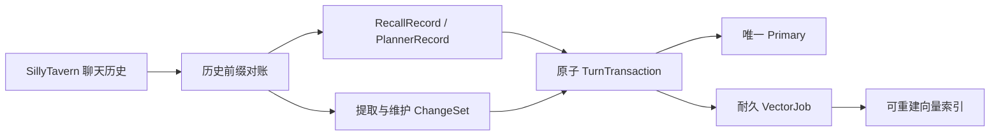

# ST-BME — SillyTavern 仿生记忆生态

> 让 AI 真正记住你们的故事，并且在故事被改写时记得回到正确的过去。

**中文** · [English](README.en.md)

ST-BME（Bionic Memory Ecology）是一个 SillyTavern 第三方扩展。它会从长期聊天中提取角色、事件、地点、规则、剧情线和主观认知，整理成可视化记忆图谱，并在下一次生成前召回最相关的内容。

v9 重写了插件的有状态内核：聊天历史、记忆图谱、召回结果、剧情规划和向量任务现在使用同一套事务模型。删楼、编辑、切换 swipe 或 reroll 时，BME 会先确认当前历史分支，再决定回退或复用什么。

> [!IMPORTANT]
> v9 是一次 clean break。它不会读取、迁移或回写 v8 及更早版本的图谱、设置、消息 metadata、OPFS、Luker、shadow snapshot 或向量集合。需要保留旧数据访问能力时，请在升级前备份旧安装及其数据。

## 核心能力

- **自动记忆提取**：AI 回复提交后，按配置从对话中提取结构化节点、关系、认知归属和故事时间。
- **混合记忆召回**：结合向量预筛、图扩散、词法增强、上下文混合、多意图与可选 LLM 精排，生成最终注入文本。
- **可靠历史回退**：编辑、删除和选择已有 swipe 会定位历史分叉点，只逆序撤销分叉后的事务。
- **稳定 reroll**：regenerate、swipe 生成和 continue 不新增 user 时，精确重放父 user 已持久化的 RecallRecord。
- **认知记忆模型**：支持客观世界、角色 POV、用户 POV、区域关系、时序关系、总结和反思。
- **自动维护**：提取后的整合、分层总结、反思、睡眠周期和压缩各自独立提交，失败不会污染之前已完成的阶段。
- **剧情规划**：ENA 是 BME 内部的可选剧情规划器，默认关闭，只在显式开启后的新 user 发送中运行。
- **可视化与管理**：内置 Canvas 图谱、节点编辑、事务记录、图谱导入导出、清空和向量重建。
- **两种持久化 Primary**：默认使用 IndexedDB，也可选择 ST-Delegation-of-authority 提供的 Authority Primary。

## 新发送、reroll 与历史修改

| 操作 | 召回行为 | ENA 行为 | 持久化结果 |
| --- | --- | --- | --- |
| 新 user 发送 | 创建新的 RecallRecord | 仅显式开启时运行 | RecallRecord；运行过 ENA 才有 PlannerRecord |
| regenerate / 生成新 swipe / continue | 精确重放父 user 的 RecallRecord；记录缺失或失效时才重新召回 | 不运行，也不读取旧 PlannerRecord | 不使用临时 handoff 状态 |
| 编辑、删除、选择已有 swipe | 先对账新的历史前缀，再回退分叉后的记录和图谱变更 | 分叉后的 PlannerRecord 一并撤销 | 保留分叉点之前的有效事务 |
| 切换聊天 | 切换到该聊天自己的状态 namespace | 取消旧聊天中的晚到规划 | 不会把异步结果写进新聊天 |


```mermaid
flowchart LR
    A["SillyTavern 聊天历史"] --> B["历史前缀对账"]
    B --> C["RecallRecord / PlannerRecord"]
    B --> D["提取与维护 ChangeSet"]
    C --> E["原子 TurnTransaction"]
    D --> E
    E --> F["唯一 Primary"]
    E --> G["耐久 VectorJob"]
    G --> H["可重建向量索引"]
```

图谱是业务状态，向量索引是派生数据。向量写入失败时，已提交的 VectorJob 会保留，之后可以安全重放或重建；向量不会成为第二份图谱事实源。

## 安装

### 默认安装：IndexedDB Primary

打开 SillyTavern 的“扩展程序 → 安装扩展”，填写仓库地址：

```text
https://github.com/Youzini-afk/ST-Bionic-Memory-Ecology
```

安装后刷新页面。默认状态为：BME 开启、IndexedDB Primary、自动提取开启、普通 user 召回开启、ENA 关闭。

### Authority Primary

Authority 模式还需要安装 [ST-Delegation-of-authority](https://github.com/Youzini-afk/ST-Delegation-of-authority)。Authority 在 SillyTavern 启动时从服务端扩展目录发现 BME 的 `.authority` 模块，因此 BME 必须是以下位置中的物理目录：

```text
SillyTavern/public/scripts/extensions/third-party/st-bme
```

不要对 `st-bme`、`.authority`、`module.json` 或 `server.cjs` 使用符号链接或 junction。安装或更新这两个插件后重启 SillyTavern，再在 BME 设置中选择 `authority` 并刷新页面。

两种 Primary 互不迁移、不会双写。Authority 不可用时，BME 会明确显示 blocked，不会偷偷回落到 IndexedDB。

## 快速开始

1. 进入一个聊天，点击页面右下角的 BME 按钮。
2. 在“设置”中确认 Primary、自动提取和普通召回状态。
3. 按需要配置 Embedding 传输、模型、Task Profiles 和正则；未配置向量时仍可使用图和词法信号，但召回质量会受影响。
4. 正常聊天。AI 回复后自动提取；下一次新 user 生成前自动召回。
5. 只有需要发送前剧情规划时才开启 ENA。普通聊天和 reroll 不依赖 ENA。

## 面板

| 页面或操作 | 用途 |
| --- | --- |
| 总览 | 查看聊天 namespace、状态、修订号、处理进度和记录数量 |
| 提取最新回复 | 强制处理当前聊天最近一条 assistant 回复 |
| 重建向量 | 提交耐久重建任务并刷新当前派生索引 |
| 图谱 | 浏览节点与关系，编辑重要度、归档状态和字段，或删除节点 |
| 事务记录 | 查看 RecallRecord、PlannerRecord 和待处理 VectorJob |
| 导出 / 导入图谱 | 传输当前 v9 图谱；只接受当前 v9 导出格式 |
| 清空图谱 | 以可随聊天历史回退的事务清空当前聊天图谱 |
| 设置 | 管理 Primary、ENA、提取、召回、Embedding、Task Profiles 和正则 |

Primary、启用状态和 prompt 注入位置变化需要刷新页面；其余设置保存后立即生效。

## 存储与一致性

- IndexedDB Primary 使用全新的 `STBME_v9` 数据库，并按聊天 namespace 隔离。
- Authority Primary 通过 BME 的 `.authority` 模块提交 SQL 状态事务，并在独立的 `bme-v9:` namespace 中维护 Trivium 派生向量。
- 设置保存在 SillyTavern 的 `extension_settings.st_bme_v9`。
- RecallRecord 和 PlannerRecord 属于 Primary，不写进聊天消息的 `message.extra`。
- 页面启动后 Primary 会固定；修改 Primary 只会在保存并刷新页面后生效。
- Primary 失败不会触发运行时切换、双写或自动数据复制。

## 常见问题

### 更新后旧图谱不见了

这是 v9 clean break 的预期行为。旧数据库没有被当作 v9 Primary 读取，也没有自动迁移。v9 图谱导入只接受 v9 导出的格式。

### reroll 为什么没有再次调用 ENA？

这是明确的生命周期规则。ENA 只规划新的 user 输入；reroll 必须复用之前已经确定的 RecallRecord，不能重新规划并改变同一个 user 楼层的语义。

### Primary 显示 blocked

检查当前选中的 Primary，而不是等待自动回落。IndexedDB 需要浏览器存储可用；Authority 需要 Authority 插件、BME companion module、权限和 `/api/plugins/authority` 服务均可用。

### 没有 Embedding 能否使用？

可以继续使用图结构、词法和其他可用信号，但向量相关召回会缺失。直连 Embedding 还可能受到浏览器 CORS 策略限制。

## 文档与开发

- [文档入口](docs/README.md)
- [v9 架构基线、数据模型与验收矩阵](docs/vnext/architecture.md)

```bash
npm ci
npm run check
npm test
```

真实宿主测试必须使用独立的 SillyTavern 数据目录、端口和测试聊天，不能复用个人实例。

## License

[GNU AGPL-3.0](LICENSE)
