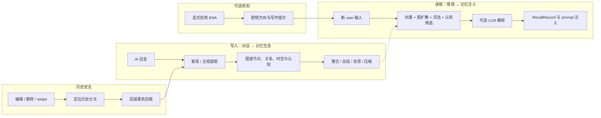

# ST-BME — SillyTavern 仿生记忆生态

> 让 AI 真正记住你们的故事。

**中文** · [English](README.en.md)

ST-BME（Bionic Memory Ecology）是一个 **SillyTavern 第三方前端扩展**。它把长期聊天中值得保留的角色、事件、地点、规则、剧情线、反思和主观记忆整理成一张持续生长的记忆图谱，并在生成前自动召回与当前情境最相关的内容。

它并不是简单地把旧聊天压成一段摘要：BME 会区分客观事实与角色视角，保存实体之间的关系、故事时间和认知边界；记忆会随着新剧情被整合、总结、反思和压缩，也会在聊天历史被编辑、删除或 reroll 时回到对应的状态。

---

## 核心能力

- **客观 + 主观双层提取** — AI 回复后，从当前对话批次提取事件、角色状态、地点、规则和主线，同时为真正参与其中的角色形成带情绪、误解和立场的 POV 记忆。
- **多层混合召回** — 结合向量预筛、图扩散、词法增强、上下文混合、多意图拆分、时间关系、认知范围、DPP 多样性采样和可选 LLM 精排。
- **认知记忆架构** — 分开维护客观世界、角色 POV 与用户 POV；角色只能召回自己有理由知道的内容，并可保留不确定认知和错误认知。
- **故事空间与时间** — 记录当前区域、区域邻接、故事时间标签和时序更新，避免把“聊天里后来提到”误当成“故事里后来发生”。
- **记忆整合与演化** — 新记忆可与旧节点对照、合并或形成更新/矛盾/演化关系，减少重复信息和彼此冲突的孤立记录。
- **分层总结与记忆压缩** — 阶段性总结逐步折叠为更高层摘要；远期记忆淡化细节但保留因果、不可逆结果、关系变化和未解决伏笔。
- **反思与可选遗忘** — 按节奏生成叙事反思，也可启用睡眠周期和低价值记忆处理，让图谱不会只增不减。
- **ENA 剧情规划** — 可选的发送前剧情规划器，读取角色卡、世界书、近期聊天、BME 记忆和历史规划，为下一轮回复提供剧情方向与写作注意事项。
- **统一任务预设** — 客观提取、主观提取、召回、整合、压缩、总结、反思和规划都使用 Task Profile，可组合 prompt 块、生成参数、世界书、正则与模板变量。
- **可视化与管理** — 内置 Canvas 图谱，可查看关系、编辑节点、归档或删除记忆，并支持图谱导入导出和向量重建。
- **历史一致性** — 删除楼层、编辑消息、选择已有 swipe、regenerate 和切换聊天时，图谱、召回记录、规划记录与派生向量都会跟随真实聊天历史对账。
- **两种持久化方式** — 默认使用浏览器 IndexedDB；也可配合 ST-Delegation-of-authority，把状态事务和派生向量交给 Authority 管理。

---

## 记忆模型

BME 默认维护以下记忆类型：

| 类型 | 记录内容 | 特点 |
| --- | --- | --- |
| `event` | 发生了什么、参与者、因果和结果 | 支持层级压缩，保留关键转折和未解决结果 |
| `character` | 角色特征、当前状态、目标、物品和长期备注 | 同一角色随剧情更新当前状态 |
| `location` | 地点状态、特征、资源和危险 | 可关联区域路径与邻接关系 |
| `rule` | 世界规则、约束、适用范围和有效状态 | 作为长期硬约束参与召回 |
| `thread` | 主线、支线、伏笔及其进展 | 支持阶段性折叠和完成状态 |
| `synopsis` | 已发生剧情的高层摘要 | 为超长对话提供稳定背景 |
| `reflection` | 对行为模式、矛盾和后续方向的高层认识 | 需要相关情境时召回 |
| `pov_memory` | 某个角色或用户如何记住一件事 | 保存情绪、态度、信念、误解与确定度 |

节点之间不仅有普通关联，还可以表达参与、发生地点、推进主线、状态更新、矛盾、记忆演化和时间替代。这样，BME 能召回“与本轮有关的一组关系”，而不只是命中几个相似句子。

### 记忆如何生长

1. AI 回复提交后，BME 读取尚未处理的对话区间。
2. 客观提取阶段生成世界层节点、关系、区域和故事时间更新。
3. 主观提取阶段为有认知依据的角色生成 POV 记忆与可见性更新。
4. 每个结果先形成图谱变更，再以独立事务提交。
5. 随后的整合、总结、反思、睡眠和压缩阶段分别运行；某一阶段失败不会撤销之前已经成功的阶段。
6. 图谱变更产生耐久向量任务，向量索引可以重放和重建，而不会成为第二份图谱事实源。

---

## 召回与生成

新 user 消息准备生成时，BME 会把当前输入与近期上下文组合成查询，然后依次使用可用的向量、图结构、词法、时间、区域和认知信号筛选记忆。候选结果可以再经过 LLM 精排，最终按核心约束、相关记忆和 POV 等内容组织成注入文本。

召回本身也会影响记忆生态：被有效访问的节点可以获得访问强化，让真正长期有用的记忆更容易在以后再次出现。

### 新发送、reroll 与历史修改

| 场景 | BME 的行为 |
| --- | --- |
| 新 user 发送 | 为该 user 楼层完成召回，并持久化最终注入文本 |
| regenerate / 生成新 swipe / continue | 精确复用父 user 已保存的召回结果；只有记录缺失或已失效时才重新召回 |
| 编辑 user 或 assistant 消息 | 从第一个发生变化的楼层开始撤销后续记忆事务，再按新历史继续处理 |
| 删除楼层 | 保留仍属于共同历史前缀的记忆，移除被删除后缀产生的图谱、召回与规划结果 |
| 选择已有 swipe | 把选中的 swipe 当作新的真实历史分支，回退旧分支之后的结果 |
| 切换聊天 | 使用该聊天独立的记忆空间；前一个聊天的晚到任务不能写入当前聊天 |

召回结果以 `RecallRecord` 绑定到对应 user 历史前缀，而不是暂存在一次性的页面变量或写进消息 `extra`。这也是 reroll 能稳定复用同一份记忆的基础。

---

## ENA 剧情规划

ENA 是 BME 的剧情规划职能，而不是普通召回的替代品。

- 默认关闭，需要用户显式启用。
- 只拦截新的 user 发送；regenerate、swipe 生成和 continue 不会重新规划。
- 规划时可以读取角色卡、世界书、BME 召回、近期聊天、玩家原始输入和之前的剧情规划。
- 规划结果以 `<plot>` 和 `<note>` 两部分参与本轮生成，并作为 `PlannerRecord` 与原始 user 输入绑定。
- 普通 user 楼层始终可以只使用 BME 召回，不需要开启 ENA。
- 删楼或编辑造成历史分叉时，分叉之后的 PlannerRecord 会与其他事务一起回退。

这种边界避免了同一个 user 楼层在 reroll 时被重新规划成另一个方向，同时仍允许用户在真正推进剧情时主动启用导演式规划。

---

## 工作原理


```mermaid
flowchart LR
    subgraph Write["写入：对话 → 记忆生态"]
        A["AI 回复"] --> B["客观 / 主观提取"]
        B --> C["图谱节点、关系、时空与认知"]
        C --> D["整合 / 总结 / 反思 / 压缩"]
    end

    subgraph Read["读取：情境 → 记忆注入"]
        E["新 user 输入"] --> F["向量 + 图扩散 + 词法 + 认知筛选"]
        F --> G["可选 LLM 精排"]
        G --> H["RecallRecord 与 prompt 注入"]
    end

    subgraph Plan["可选规划"]
        I["显式启用 ENA"] --> J["剧情方向与写作提示"]
        J --> E
    end

    subgraph Safe["历史安全"]
        K["编辑 / 删除 / swipe"] --> L["定位历史分叉"]
        L --> M["回退事务后缀"]
        M --> B
    end

    D -.-> F
```

内部使用 `TurnTransaction + ChangeSet` 原子提交每个阶段。每个事务都记录它基于哪段聊天历史、修改了哪些节点和记录，以及如何逆向撤销；因此历史恢复不需要在多份快照之间猜测哪份才是真的。

---

## 安装

### 通过 SillyTavern 安装

打开 SillyTavern → 扩展程序 → 安装扩展，输入仓库地址：

```text
https://github.com/Youzini-afk/ST-Bionic-Memory-Ecology
```

安装后刷新页面。默认启用 BME、自动提取和普通 user 召回，使用 IndexedDB 保存数据；ENA 默认关闭。

### 使用 Authority Primary

Authority 模式还需要安装 [ST-Delegation-of-authority](https://github.com/Youzini-afk/ST-Delegation-of-authority)。Authority 会在 SillyTavern 启动时发现 BME 的服务端模块，因此 BME 必须是物理目录：

```text
SillyTavern/public/scripts/extensions/third-party/st-bme
```

不要对 `st-bme`、`.authority`、`module.json` 或 `server.cjs` 使用符号链接或 junction。安装或更新后重启 SillyTavern，在 BME 设置中选择 `authority`，保存并刷新页面。

> **升级说明：** 当前主版本使用全新的设置和数据空间，不会自动读取或迁移旧主版本数据。如需保留旧数据访问能力，请在升级前备份旧安装及其数据。

---

## 快速上手

1. **打开聊天** — 进入需要使用长期记忆的角色或群聊。
2. **打开 BME 面板** — 点击页面右下角的脑形 BME 按钮。
3. **确认运行状态** — “总览”应显示 `indexeddb · ready`，或显示你主动配置的 Authority Primary。
4. **配置任务模型** — Task Profile 可以复用当前 SillyTavern 路由，也可以为不同任务指定独立的 OpenAI-compatible 模型与生成参数。
5. **配置 Embedding** — 可走 SillyTavern 后端，也可直连 Embedding API；直连模式需要服务端允许浏览器 CORS。
6. **开始聊天** — AI 回复后自动提取，新 user 生成前自动召回。
7. **检查图谱** — 在“图谱”中查看节点和关系，在“事务记录”中查看召回、规划与向量任务。
8. **按需开启 ENA** — 只有希望在发送前增加剧情规划时才开启。

没有可用 Embedding 时，BME 仍可使用图结构、词法和其他信号，但召回质量与候选覆盖会下降。

---

## 面板与常用操作

| 页面或操作 | 说明 |
| --- | --- |
| 总览 | 当前 Primary、运行状态、聊天标识、修订号、处理进度、节点和记录数量 |
| 刷新 | 重新读取当前聊天的持久状态 |
| 提取最新回复 | 强制处理最近一条 assistant 回复，适合补提取或调试配置 |
| 重建向量 | 创建耐久重建任务，并让当前 Primary 的派生向量与图谱重新一致 |
| 导出图谱 | 导出当前聊天的图谱、认知、区域、时间线和总结状态，不包含 embedding |
| 导入图谱 | 导入当前版本导出的图谱，并自动安排向量重建 |
| 清空图谱 | 以可回退事务清空当前聊天图谱，不影响其他聊天 |
| 图谱 | 浏览节点与边；编辑重要度、归档状态和字段，或删除节点 |
| 事务记录 | 查看 RecallRecord、PlannerRecord 和 VectorJob |
| 设置 | 管理 Primary、ENA、提取频率、召回上限、Embedding、Task Profiles 和全局正则 |

Primary、BME 启用状态和 prompt 注入位置在页面启动时固定，修改后需要刷新页面；其他面板设置保存后立即生效。

---

## 配置重点

| 配置组 | 主要作用 |
| --- | --- |
| Primary | 在 IndexedDB 与 Authority 之间选择唯一事实源；两者不双写、不自动迁移，也不会在故障时静默切换 |
| 自动提取 | 控制是否处理 assistant 回复、每隔几次提取，以及提取上下文和排除标签 |
| 普通召回 | 控制是否在新 user 生成前召回、候选数量和最终注入上限 |
| Embedding | 选择后端或直连传输、模型、维度和批量大小 |
| Task Profiles | 分任务管理 prompt 块、模型路由、生成参数、输入来源和世界书行为 |
| Global Regex | 继承 SillyTavern 正则，并可按任务阶段增加本地清洗规则 |
| 认知与时空 | 控制 POV、区域范围、空间邻接、故事时间和各认知层的召回权重 |
| 维护策略 | 控制整合、分层总结、反思、睡眠周期、压缩及其触发频率 |
| ENA | 控制剧情规划开关、规划召回和 `planner` Task Profile |

Task Profile 覆盖 `extract_objective`、`extract_subjective`、`recall`、`consolidation`、`compress`、`synopsis`、`reflection`、`summary_rollup` 和 `planner`。每类任务可以使用自己的消息块顺序、世界书内容、正则和生成配置。

---

## 数据存储与一致性

- **聊天隔离** — 每个聊天拥有独立状态 namespace，切换角色或聊天不会共用图谱事务。
- **IndexedDB** — 默认 Primary，数据保存在浏览器的 `STBME_v9` 数据库中。
- **Authority** — 使用 BME companion module 提交 SQL 状态事务，并在独立 `bme-v9:` namespace 管理 Trivium 派生向量。
- **单一事实源** — 页面启动后只使用选定的 Primary；失败会明确显示 blocked，不会偷偷读写另一份数据。
- **精确回退** — 历史变化只撤销分叉点之后的事务，分叉点之前的图谱、召回和规划保持不变。
- **派生向量** — 图谱提交时写入 VectorJob；向量失败不会制造一份与图谱竞争的状态。
- **并发安全** — 提交使用版本比较；聊天切换、手动编辑或新修订会使旧异步任务失效。
- **设置隔离** — 当前设置保存在 `extension_settings.st_bme_v9`，不读取旧设置 namespace。

---

## 排障

### 面板显示 blocked

检查当前选中的 Primary。IndexedDB 需要浏览器存储可用；Authority 需要 Authority 插件、BME companion module、权限和 `/api/plugins/authority` 服务都正常。BME 不会用自动 fallback 掩盖 Primary 故障。

### AI 回复后没有自动提取

确认 BME 与“自动提取 assistant 回复”已开启，当前回复已经提交到聊天历史，并检查 Task Profile 所用模型是否可用。也可以先使用“提取最新回复”观察面板返回的具体阶段和错误。

### 召回结果很少或不相关

先检查图谱是否已有节点，再检查 Embedding 配置、模型是否变化、召回节点上限和 `recall` Task Profile。更换 Embedding 模型或维度后应执行“重建向量”。

### reroll 没有再次运行 ENA

这是预期行为。reroll 使用父 user 已经确定的召回结果，不重新规划同一个输入；ENA 只处理新的 user 发送。

### 直连 Embedding 请求失败

确认 API 地址、Key、模型和响应格式，并检查浏览器控制台是否为 CORS 拦截。无法开放 CORS 时改用 SillyTavern 后端传输。

### 更新后看不到旧图谱

当前主版本使用新的数据空间，旧主版本数据不会自动迁移，旧格式导出也不能直接作为当前图谱导入。

---

## 已知限制

- **记忆质量依赖 LLM** — 提取模型如果误解剧情、角色视角或时间关系，图谱也会继承这些错误。
- **Embedding 影响召回下限** — 没有合适的向量模型时，召回会更多依赖词法和图结构。
- **直连 API 受浏览器约束** — CORS、HTTPS 混合内容和代理策略都可能阻止直连请求。
- **超长聊天仍有成本** — 分层总结和压缩能控制记忆规模，但提取、维护和召回仍然需要模型与计算资源。
- **高级配置偏技术化** — Task Profiles 与全局正则目前使用 JSON 编辑，修改前建议保留可工作的副本。
- **两种 Primary 数据独立** — 切换 Primary 不等于迁移；需要迁移时应先在原 Primary 导出当前图谱，再在目标 Primary 导入。
- **只导入当前图谱格式** — 为避免把旧结构重新带进事实源，图谱导入只接受当前版本的导出格式。

---

## 文档与开发

- [文档入口](docs/README.md)
- [架构基线、数据模型、事务协议与验收矩阵](docs/vnext/architecture.md)

```bash
npm ci
npm run check
npm test
```

真实宿主验证必须使用独立的 SillyTavern 数据目录、端口和测试聊天，不能复用个人实例。

---

## License

[GNU AGPL-3.0](LICENSE)
