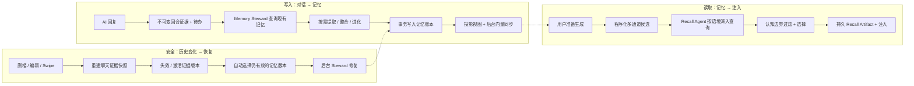

# ST-BME — SillyTavern 仿生记忆生态

> 让 AI 真正记住你们的故事。

**中文** · [English](README.en.md)

ST-BME（Bionic Memory Ecology）是一个 **SillyTavern 第三方前端扩展**。它会把长期聊天中出现的角色、事件、地点、规则、主线、反思和总结抽取成一张可视化记忆图谱，并在下一轮生成前自动召回最相关的记忆注入 prompt。

---

## 文档导航

本 README 提供完整的产品概览与快速入口；配置细节、内部原理和维护约定在 [`docs/`](docs/README.md)：

| 你想做什么 | 去哪看 |
| --- | --- |
| 配置、面板、排障、存储等使用说明 | [`docs/usage/`](docs/usage/) |
| 理解架构、控制平面、数据格式 | [`docs/architecture/`](docs/architecture/) |
| 理解检索/提取/向量等算法原理 | [`docs/algorithms/`](docs/algorithms/) |
| 理解各功能的机制与边界 | [`docs/features/`](docs/features/) |
| 参与开发、测试、贡献约定 | [`docs/contributing/`](docs/contributing/) |

常用直达：[配置参考](docs/usage/configuration.md) · [面板导览](docs/usage/panel.md) · [排障指南](docs/usage/troubleshooting.md) · [记忆模型](docs/features/memory-model.md) · [历史安全](docs/features/history-safety.md)

---

## 核心能力

- **后台 Memory Steward** — AI 回复进入聊天后形成不可变证据与待办，由 Agent 自主决定提取、整合、纠错、总结或暂不修改；每次工具写入都走聊天级事务。
- **多层 Agent 召回** — 程序化候选快速覆盖向量、图、词法、时间与未索引尾部，再由 Recall Agent 按当前语境深入查询和选择；结果以回合 Artifact 持久化并显示召回卡片。
- **认知架构** — 角色 POV / 用户 POV / 客观世界记忆，空间区域权重，故事时间线。
- **自主进化与维护** — 去重、冲突演化、总结、关系修复和遗忘不再由固定频率串行触发，而由 Memory Steward 根据证据和现有记忆按需使用工具完成。
- **图谱可视化** — 内置 Canvas 力导向图谱，支持实时/认知/总结视图和移动端视图。
- **任务预设系统** — BME Agent 与 ENA 使用 BME 自己配置的模型；任务预设继续提供提示词、正则、世界书和 EJS 扩展能力。
- **ENA Planner 集成** — 默认关闭、显式启用的发送前剧情规划；只介入新 user 消息，并与 BME 召回及 `planner` 任务预设共享同一回合语义。
- **持久化与同步** — 记忆按聊天记录而非角色卡隔离；普通 ST 自动选择 OPFS / IndexedDB，兼容 Luker chat-state 与 Authority SQL，并提供浏览器本地存储的 Cloud Sync、独立备份/恢复、重建和修复。
- **历史安全** — 删楼、编辑、swipe 和 reroll 会使对应证据版本失效或重新激活，依赖它的记忆自动回到仍然有效的版本；reroll 精确复用父 user 回合的 Recall / Planner Artifact，不重复运行 ENA。
- **长聊天优化** — 隐藏旧楼层控制 token，限制渲染楼层降低卡顿，关键计算支持 Native/WASM 灰度加速。

---

## 工作原理

ST-BME 可以理解为三条链路：**写入**（对话 → 记忆）、**读取**（记忆 → 注入）、**安全**（历史变化 → 恢复）。


```mermaid
flowchart LR
    subgraph Write["写入：对话 → 记忆"]
        A["AI 回复"] --> B["不可变回合证据 + 待办"]
        B --> C["Memory Steward 查询现有记忆"]
        C --> D["按需提取 / 整合 / 进化"]
        D --> E["事务写入记忆账本"]
        E --> F["投影视图 + 后台向量同步"]
    end

    subgraph Read["读取：记忆 → 注入"]
        G["用户准备生成"] --> H["程序化多通道候选"]
        H --> I["Recall Agent 按语境深入查询"]
        I --> J["认知边界过滤 + 选择"]
        J --> K["持久 Recall Artifact + 注入"]
    end

    subgraph Safe["安全：历史变化 → 恢复"]
        L["删楼 / 编辑 / Swipe"] --> M["重建聊天证据快照"]
        M --> N["失效 / 激活证据版本"]
        N --> O["自动选择仍有效的记忆版本"]
        O --> P["后台 Steward 修复"]
    end

    F -.-> G
    P -.-> E
```

- **写入**：对话先落为不可变证据与待办；Memory Steward 在后台读取上下文、查询账本并用工具提交记忆修订，图谱只是可重建投影。
- **读取**：快速候选先覆盖常见路径，Recall Agent 可继续按索引深入查询；最终选择与注入文本作为回合 Artifact 保存，空结果也会明确落盘。
- **安全**：历史变化通过证据失效/激活传播到记忆版本，不再依赖逆向猜测旧批次；聊天切换后的晚到任务只能写回其原聊天账本。

> 算法细节（公式、参数、阈值）见 [`docs/algorithms/`](docs/algorithms/)；架构与数据路径见 [`docs/architecture/overview.md`](docs/architecture/overview.md)。

---

## 安装

### 方法一：通过 SillyTavern 扩展安装

打开 SillyTavern → 扩展管理 → 安装第三方扩展，输入仓库地址：

```text
https://github.com/Youzini-afk/ST-Bionic-Memory-Ecology
```

安装后刷新页面。

> 请粘贴仓库根地址，不要粘贴 GitHub 的子页面地址。

### 方法二：手动安装

```bash
cd SillyTavern/data/default-user/extensions
git clone https://github.com/Youzini-afk/ST-Bionic-Memory-Ecology.git st-bme
```

然后重启或刷新 SillyTavern。

---

## 快速上手

1. **打开面板** — 左上角菜单点击"记忆图谱"。
2. **启用插件** — 配置 → 功能开关，确认主开关已启用。
3. **配置模型** — 在“API 配置”填写 BME 专用的地址、Key 与模型；Memory Steward、召回 Agent 和 ENA 共用它，但不会借用当前聊天模型或 DOA 的模型。
4. **配置 Embedding** — 默认使用直连 Embedding API，可连接独立的外部 embedding 服务；也可切换到 SillyTavern 后端索引，但仅能使用宿主支持的向量来源。直连时需确保服务允许浏览器跨域访问。
5. **开始聊天** — 正常对话即可；AI 回复进入聊天后，Memory Steward 在后台整理账本，下次生成前由 Recall Agent 召回。
6. **查看结果** — "总览"看状态，"任务 → 记忆浏览"看节点，图谱区域看关系网络，用户消息下方可能出现召回卡片。

> 最小可用配置：启用插件 + 配置 BME 专用模型。Embedding 不可用时仍可使用确定性候选与未索引尾部召回，但建议配置外部 Embedding 以提高覆盖率。
>
> 完整配置说明见 [配置参考](docs/usage/configuration.md)，面板每个区域的用途见 [面板导览](docs/usage/panel.md)。

---

## 常用操作速查

| 操作 | 位置 | 说明 |
| --- | --- | --- |
| 重新提取 | 操作 → 记忆操作 | 提取未处理楼层或重跑指定范围 |
| 手动压缩 | 操作 → 记忆操作 | 合并冗余高层节点 |
| 生成小总结 | 操作 → 记忆操作 | 为近期原文窗口生成阶段性总结 |
| 执行总结折叠 | 操作 → 记忆操作 | 把多条活跃总结折叠成更高层总结 |
| 重建总结状态 | 操作 → 记忆操作 | 从提取批次重建 summaryState |
| 强制进化 | 操作 → 记忆操作 | 让新记忆主动影响旧记忆 |
| 执行遗忘 | 操作 → 记忆操作 | 归档或降权低价值节点 |
| 撤销最近维护 | 操作 → 记忆操作 | 回滚最近可撤销维护 |
| 重建向量 | 操作 → 向量操作 | 重建全部节点 embedding |
| 范围重建 | 操作 → 向量操作 | 只重建指定楼层范围相关节点 |
| 直连重嵌 | 操作 → 向量操作 | 使用直连 embedding 配置重嵌 |
| 导出 / 导入 / 重建图谱 | 操作 → 图谱管理 | 图谱管理与危险操作 |
| 备份 / 恢复云端 | 配置 → 云端同步 | 手动备份方式下主动上传/恢复当前聊天副本 |
| 取消全部隐藏 | 配置 → 隐藏旧楼层 | 恢复 ST-BME 隐藏的楼层 |

> 切换 embedding 模式或模型后，建议执行"重建向量"。各操作的细节和危险提示见 [配置参考](docs/usage/configuration.md) 和 [面板导览](docs/usage/panel.md)。

---

## 数据存储与历史安全（要点）

- **按聊天隔离的主存储**：每张聊天记录独立绑定一个耐久主源，同一角色卡的多张聊天不会共享记忆。普通 SillyTavern 自动选择 OPFS / IndexedDB；Luker 使用 chat-state；Authority 可用时由 SQL 成为规范主源。
- **跨设备与备份**：Cloud Sync 只复制浏览器本地的 OPFS / IndexedDB；Authority SQL 本身已经跨设备共享，不再叠加第二份 Cloud Sync。手动服务器备份与自动镜像是独立对象。
- **历史安全**：删楼、编辑、swipe 会追加证据失效/激活记录，并自动投影仍然有效的记忆版本；渲染切片截断有保护，避免误判完整历史。
- **一次迁移、单一主源**：旧图谱通过原子事务一次性导入聊天账本；之后图谱、时间线与向量都只是可重建投影，不与账本形成双写主源。

> 详见 [存储与同步](docs/usage/storage-and-sync.md)、[历史安全](docs/features/history-safety.md)、[数据格式与向前兼容](docs/architecture/storage-and-formats.md)。

---

## 遇到问题？

常见情况（面板打不开、后台不产生记忆、召回质量差、节点看似清空、召回卡片不显示、直连 Embedding 失败等）的排查步骤见 [排障指南](docs/usage/troubleshooting.md)。

---

## 已知限制

- **记忆质量依赖 LLM** — 提取模型理解错误时记忆也会错误。
- **Embedding 决定召回下限** — 没有高质量向量，召回更依赖词法和图结构。
- **直连模式可能受 CORS 影响** — 浏览器安全策略可能阻止请求。
- **超长聊天仍有成本** — 隐藏/渲染限制/总结折叠能降低压力，但不能消除所有开销。
- **历史修复优先正确性** — 冲突或损坏状态会停止提交并要求修复，不会猜测性覆盖账本。
- **第三方主题可能影响召回卡片挂载** — 移除标准消息 DOM 或楼层索引属性时卡片可能跳过挂载。
- **Native 加速是灰度能力** — 默认 fail-open，失败回退 JS，可在面板强制关闭。

---

## License

AGPLv3 — 详见 [LICENSE](./LICENSE)。
